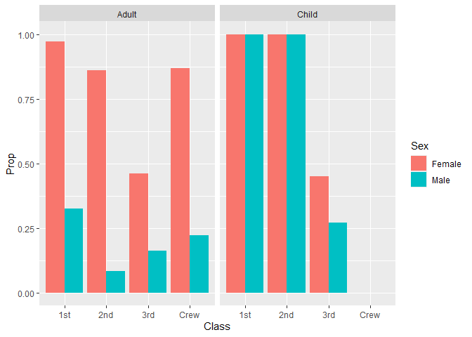

RMS Titanic
================
Bhargavi Deshpande
01/27/2025

- [Grading Rubric](#grading-rubric)
  - [Individual](#individual)
  - [Submission](#submission)
- [First Look](#first-look)
  - [**q1** Perform a glimpse of `df_titanic`. What variables are in
    this
    dataset?](#q1-perform-a-glimpse-of-df_titanic-what-variables-are-in-this-dataset)
  - [**q2** Skim the Wikipedia article on the RMS Titanic, and look for
    a total count of souls aboard. Compare against the total computed
    below. Are there any differences? Are those differences large or
    small? What might account for those
    differences?](#q2-skim-the-wikipedia-article-on-the-rms-titanic-and-look-for-a-total-count-of-souls-aboard-compare-against-the-total-computed-below-are-there-any-differences-are-those-differences-large-or-small-what-might-account-for-those-differences)
  - [**q3** Create a plot showing the count of persons who *did*
    survive, along with aesthetics for `Class` and `Sex`. Document your
    observations
    below.](#q3-create-a-plot-showing-the-count-of-persons-who-did-survive-along-with-aesthetics-for-class-and-sex-document-your-observations-below)
- [Deeper Look](#deeper-look)
  - [**q4** Replicate your visual from q3, but display `Prop` in place
    of `n`. Document your observations, and note any new/different
    observations you make in comparison with q3. Is there anything
    *fishy* in your
    plot?](#q4-replicate-your-visual-from-q3-but-display-prop-in-place-of-n-document-your-observations-and-note-any-newdifferent-observations-you-make-in-comparison-with-q3-is-there-anything-fishy-in-your-plot)
  - [**q5** Create a plot showing the group-proportion of occupants who
    *did* survive, along with aesthetics for `Class`, `Sex`, *and*
    `Age`. Document your observations
    below.](#q5-create-a-plot-showing-the-group-proportion-of-occupants-who-did-survive-along-with-aesthetics-for-class-sex-and-age-document-your-observations-below)
- [Notes](#notes)

*Purpose*: Most datasets have at least a few variables. Part of our task
in analyzing a dataset is to understand trends as they vary across these
different variables. Unless we’re careful and thorough, we can easily
miss these patterns. In this challenge you’ll analyze a dataset with a
small number of categorical variables and try to find differences among
the groups.

*Reading*: (Optional) [Wikipedia
article](https://en.wikipedia.org/wiki/RMS_Titanic) on the RMS Titanic.

<!-- include-rubric -->

# Grading Rubric

<!-- -------------------------------------------------- -->

Unlike exercises, **challenges will be graded**. The following rubrics
define how you will be graded, both on an individual and team basis.

## Individual

<!-- ------------------------- -->

| Category | Needs Improvement | Satisfactory |
|----|----|----|
| Effort | Some task **q**’s left unattempted | All task **q**’s attempted |
| Observed | Did not document observations, or observations incorrect | Documented correct observations based on analysis |
| Supported | Some observations not clearly supported by analysis | All observations clearly supported by analysis (table, graph, etc.) |
| Assessed | Observations include claims not supported by the data, or reflect a level of certainty not warranted by the data | Observations are appropriately qualified by the quality & relevance of the data and (in)conclusiveness of the support |
| Specified | Uses the phrase “more data are necessary” without clarification | Any statement that “more data are necessary” specifies which *specific* data are needed to answer what *specific* question |
| Code Styled | Violations of the [style guide](https://style.tidyverse.org/) hinder readability | Code sufficiently close to the [style guide](https://style.tidyverse.org/) |

## Submission

<!-- ------------------------- -->

Make sure to commit both the challenge report (`report.md` file) and
supporting files (`report_files/` folder) when you are done! Then submit
a link to Canvas. **Your Challenge submission is not complete without
all files uploaded to GitHub.**

``` r
library(tidyverse)
```

    ## ── Attaching core tidyverse packages ──────────────────────── tidyverse 2.0.0 ──
    ## ✔ dplyr     1.1.4     ✔ readr     2.1.5
    ## ✔ forcats   1.0.0     ✔ stringr   1.5.1
    ## ✔ ggplot2   3.5.1     ✔ tibble    3.2.1
    ## ✔ lubridate 1.9.4     ✔ tidyr     1.3.1
    ## ✔ purrr     1.0.2     
    ## ── Conflicts ────────────────────────────────────────── tidyverse_conflicts() ──
    ## ✖ dplyr::filter() masks stats::filter()
    ## ✖ dplyr::lag()    masks stats::lag()
    ## ℹ Use the conflicted package (<http://conflicted.r-lib.org/>) to force all conflicts to become errors

``` r
df_titanic <- as_tibble(Titanic)
```

*Background*: The RMS Titanic sank on its maiden voyage in 1912; about
67% of its passengers died.

# First Look

<!-- -------------------------------------------------- -->

### **q1** Perform a glimpse of `df_titanic`. What variables are in this dataset?

``` r
## TASK: Perform a `glimpse` of df_titanic
df_titanic %>% glimpse
```

    ## Rows: 32
    ## Columns: 5
    ## $ Class    <chr> "1st", "2nd", "3rd", "Crew", "1st", "2nd", "3rd", "Crew", "1s…
    ## $ Sex      <chr> "Male", "Male", "Male", "Male", "Female", "Female", "Female",…
    ## $ Age      <chr> "Child", "Child", "Child", "Child", "Child", "Child", "Child"…
    ## $ Survived <chr> "No", "No", "No", "No", "No", "No", "No", "No", "No", "No", "…
    ## $ n        <dbl> 0, 0, 35, 0, 0, 0, 17, 0, 118, 154, 387, 670, 4, 13, 89, 3, 5…

**Observations**:

- Class, Sex, Age, Survived, Number of persons in that classification of
  people

### **q2** Skim the [Wikipedia article](https://en.wikipedia.org/wiki/RMS_Titanic) on the RMS Titanic, and look for a total count of souls aboard. Compare against the total computed below. Are there any differences? Are those differences large or small? What might account for those differences?

``` r
## NOTE: No need to edit! We'll cover how to
## do this calculation in a later exercise.
df_titanic %>% summarize(total = sum(n))
```

    ## # A tibble: 1 × 1
    ##   total
    ##   <dbl>
    ## 1  2201

**Observations**:

- The Wikepedia page said that there were 2224 passengers and the data
  count says 2201
- Are there any differences?
  - Yes the Wikepedia page accoubt for approxiametely 23 souls
- If yes, what might account for those differences?
  - Since the dataset counts souls based on their classification, maybe
    there were individuals that did not fall under these classifications
    and therefore did not get counted
  - Another difference could be from how each source found their number
    of passengers. If the Wikepedia page determined their number passed
    on people boarded at the port while the data set had collected
    number of tickets, that could cause inconsistencies.

### **q3** Create a plot showing the count of persons who *did* survive, along with aesthetics for `Class` and `Sex`. Document your observations below.

*Note*: There are many ways to do this.

``` r
## TASK: Visualize counts against `Class` and `Sex`
d_survived <- df_titanic %>% filter( Survived == "Yes")
d_survived %>%
  ggplot() + geom_col(aes(x=Class, y=n, fill = Sex), position = "dodge")
```

<!-- -->

**Observations**:

- Within the First and Second Class a lot more women survived the
  Titanic sinking. This makes sense from background knowledge, knowing
  that women and children who were in the upper classes were put onto
  lifeboats first. Additionally significantly more male crew members
  survived, however, this could either be because they were allowed to
  board lifeboats first or simply because at this time a majority of the
  crew were women not men.

# Deeper Look

<!-- -------------------------------------------------- -->

Raw counts give us a sense of totals, but they are not as useful for
understanding differences between groups. This is because the
differences we see in counts could be due to either the relative size of
the group OR differences in outcomes for those groups. To make
comparisons between groups, we should also consider *proportions*.\[1\]

The following code computes proportions within each `Class, Sex, Age`
group.

``` r
## NOTE: No need to edit! We'll cover how to
## do this calculation in a later exercise.
df_prop <-
  df_titanic %>%
  group_by(Class, Sex, Age) %>%
  mutate(
    Total = sum(n),
    Prop = n / Total
  ) %>%
  ungroup()
df_prop
```

    ## # A tibble: 32 × 7
    ##    Class Sex    Age   Survived     n Total    Prop
    ##    <chr> <chr>  <chr> <chr>    <dbl> <dbl>   <dbl>
    ##  1 1st   Male   Child No           0     5   0    
    ##  2 2nd   Male   Child No           0    11   0    
    ##  3 3rd   Male   Child No          35    48   0.729
    ##  4 Crew  Male   Child No           0     0 NaN    
    ##  5 1st   Female Child No           0     1   0    
    ##  6 2nd   Female Child No           0    13   0    
    ##  7 3rd   Female Child No          17    31   0.548
    ##  8 Crew  Female Child No           0     0 NaN    
    ##  9 1st   Male   Adult No         118   175   0.674
    ## 10 2nd   Male   Adult No         154   168   0.917
    ## # ℹ 22 more rows

### **q4** Replicate your visual from q3, but display `Prop` in place of `n`. Document your observations, and note any new/different observations you make in comparison with q3. Is there anything *fishy* in your plot?

``` r
d_survived <- df_prop %>% filter( Survived == "Yes")
d_survived %>%
  ggplot() + geom_col(aes(x=Class, y=Prop, fill = Sex), position = "dodge")
```

    ## Warning: Removed 2 rows containing missing values or values outside the scale range
    ## (`geom_col()`).

<!-- -->

**Observations**:

- The graph demonstrates the proportion of people in each category that
  survived. This doesn’t sway the visualization by only having the count
  of people who survived without knowing how many were on the ship in
  the first place.
- Is there anything *fishy* going on in your plot? Yes, there is
  something weird happening on the plot because it says all of the
  people, both men and women in the 1st and 2nd class survived. However,
  from the raw data we see that this is not the real case. I think this
  is because the data for the children is being mixed into the adult
  data since children are also classified with Male and Female in the
  data set.

### **q5** Create a plot showing the group-proportion of occupants who *did* survive, along with aesthetics for `Class`, `Sex`, *and* `Age`. Document your observations below.

*Hint*: Don’t forget that you can use `facet_grid` to help consider
additional variables!

``` r
d_survived <- df_prop %>% filter(Survived == "Yes", Age == "Adult")

d_survived %>%
  ggplot() + geom_col(mapping = aes(x = Class, y = Prop, fill = Sex), position = "dodge")
```

<!-- -->

**Observations**:

- Now the proportion of women who survived is no longer 100%, it is more
  reflective of the data set. Compared to the graph that visualizes the
  total number of survived individuals in each category, this graph is
  much more insightful. This one allows us to see the pattern that women
  were able to leave the Titanic first compared to men. This can be seen
  through the crew data. While 150 more male crew members survived
  compared to female, 88% of female crew members survived compared to
  the 20% female.
- If you saw something *fishy* in q4 above, use your new plot to explain
  the fishy-ness.
  - For q4, the code is plotting, of the people who survived, the
    proportion of the group (Female or Male) that falls under each
    class. However, the children are also categorized by Male or Female
    and are placed at the top of the data set. This means that as the
    code is plotting, the first grouping to meet the requirements of
    that bar on the graph are from the children data. For example, when
    looking at the Men who were in first class who survived, the first
    group of people who fall under this classification are the children
    in row 17. Since there were few children on board the Titanic, the
    ones in first and second class all survived. This is why the graph
    on q4 had the proportion for male and female being 1. Once the data
    was also filtered by age, like the graph of q5, the plot becomes
    more indicative of the proportions of adult males and females who
    survived in each class.

# Notes

<!-- -------------------------------------------------- -->

\[1\] This is basically the same idea as [Dimensional
Analysis](https://en.wikipedia.org/wiki/Dimensional_analysis); computing
proportions is akin to non-dimensionalizing a quantity.
