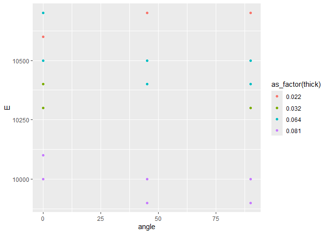
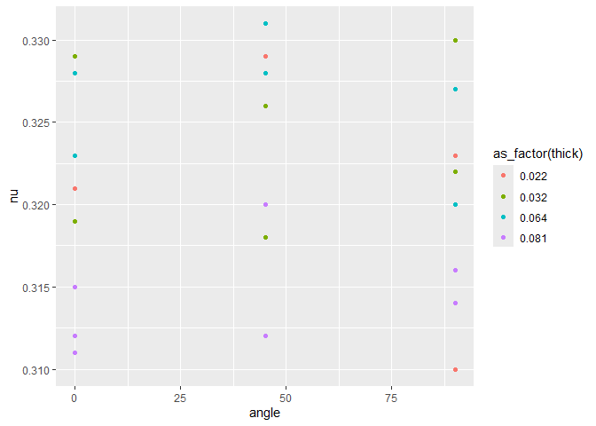

Aluminum Data
================
(Your name here)
2020-

- [Grading Rubric](#grading-rubric)
  - [Individual](#individual)
  - [Submission](#submission)
- [Loading and Wrangle](#loading-and-wrangle)
  - [**q1** Tidy `df_stang` to produce `df_stang_long`. You should have
    column names `thick, alloy, angle, E, nu`. Make sure the `angle`
    variable is of correct type. Filter out any invalid
    values.](#q1-tidy-df_stang-to-produce-df_stang_long-you-should-have-column-names-thick-alloy-angle-e-nu-make-sure-the-angle-variable-is-of-correct-type-filter-out-any-invalid-values)
- [EDA](#eda)
  - [Initial checks](#initial-checks)
    - [**q2** Perform a basic EDA on the aluminum data *without
      visualization*. Use your analysis to answer the questions under
      *observations* below. In addition, add your own *specific*
      question that you’d like to answer about the data—you’ll answer it
      below in
      q3.](#q2-perform-a-basic-eda-on-the-aluminum-data-without-visualization-use-your-analysis-to-answer-the-questions-under-observations-below-in-addition-add-your-own-specific-question-that-youd-like-to-answer-about-the-datayoull-answer-it-below-in-q3)
  - [Visualize](#visualize)
    - [**q3** Create a visualization to investigate your question from
      q2 above. Can you find an answer to your question using the
      dataset? Would you need additional information to answer your
      question?](#q3-create-a-visualization-to-investigate-your-question-from-q2-above-can-you-find-an-answer-to-your-question-using-the-dataset-would-you-need-additional-information-to-answer-your-question)
    - [**q4** Consider the following
      statement:](#q4-consider-the-following-statement)
- [References](#references)

*Purpose*: When designing structures such as bridges, boats, and planes,
the design team needs data about *material properties*. Often when we
engineers first learn about material properties through coursework, we
talk about abstract ideas and look up values in tables without ever
looking at the data that gave rise to published properties. In this
challenge you’ll study an aluminum alloy dataset: Studying these data
will give you a better sense of the challenges underlying published
material values.

In this challenge, you will load a real dataset, wrangle it into tidy
form, and perform EDA to learn more about the data.

<!-- include-rubric -->

# Grading Rubric

<!-- -------------------------------------------------- -->

Unlike exercises, **challenges will be graded**. The following rubrics
define how you will be graded, both on an individual and team basis.

## Individual

<!-- ------------------------- -->

| Category | Needs Improvement | Satisfactory |
|----|----|----|
| Effort | Some task **q**’s left unattempted | All task **q**’s attempted |
| Observed | Did not document observations, or observations incorrect | Documented correct observations based on analysis |
| Supported | Some observations not clearly supported by analysis | All observations clearly supported by analysis (table, graph, etc.) |
| Assessed | Observations include claims not supported by the data, or reflect a level of certainty not warranted by the data | Observations are appropriately qualified by the quality & relevance of the data and (in)conclusiveness of the support |
| Specified | Uses the phrase “more data are necessary” without clarification | Any statement that “more data are necessary” specifies which *specific* data are needed to answer what *specific* question |
| Code Styled | Violations of the [style guide](https://style.tidyverse.org/) hinder readability | Code sufficiently close to the [style guide](https://style.tidyverse.org/) |

## Submission

<!-- ------------------------- -->

Make sure to commit both the challenge report (`report.md` file) and
supporting files (`report_files/` folder) when you are done! Then submit
a link to Canvas. **Your Challenge submission is not complete without
all files uploaded to GitHub.**

``` r
library(tidyverse)
```

    ## ── Attaching core tidyverse packages ──────────────────────── tidyverse 2.0.0 ──
    ## ✔ dplyr     1.1.4     ✔ readr     2.1.5
    ## ✔ forcats   1.0.0     ✔ stringr   1.5.1
    ## ✔ ggplot2   3.5.1     ✔ tibble    3.2.1
    ## ✔ lubridate 1.9.4     ✔ tidyr     1.3.1
    ## ✔ purrr     1.0.2     
    ## ── Conflicts ────────────────────────────────────────── tidyverse_conflicts() ──
    ## ✖ dplyr::filter() masks stats::filter()
    ## ✖ dplyr::lag()    masks stats::lag()
    ## ℹ Use the conflicted package (<http://conflicted.r-lib.org/>) to force all conflicts to become errors

*Background*: In 1946, scientists at the Bureau of Standards tested a
number of Aluminum plates to determine their
[elasticity](https://en.wikipedia.org/wiki/Elastic_modulus) and
[Poisson’s ratio](https://en.wikipedia.org/wiki/Poisson%27s_ratio).
These are key quantities used in the design of structural members, such
as aircraft skin under [buckling
loads](https://en.wikipedia.org/wiki/Buckling). These scientists tested
plats of various thicknesses, and at different angles with respect to
the [rolling](https://en.wikipedia.org/wiki/Rolling_(metalworking))
direction.

# Loading and Wrangle

<!-- -------------------------------------------------- -->

The `readr` package in the Tidyverse contains functions to load data
form many sources. The `read_csv()` function will help us load the data
for this challenge.

``` r
## NOTE: If you extracted all challenges to the same location,
## you shouldn't have to change this filename
filename <- "./data/stang.csv"

## Load the data
df_stang <- read_csv(filename)
```

    ## Rows: 9 Columns: 8
    ## ── Column specification ────────────────────────────────────────────────────────
    ## Delimiter: ","
    ## chr (1): alloy
    ## dbl (7): thick, E_00, nu_00, E_45, nu_45, E_90, nu_90
    ## 
    ## ℹ Use `spec()` to retrieve the full column specification for this data.
    ## ℹ Specify the column types or set `show_col_types = FALSE` to quiet this message.

``` r
df_stang
```

    ## # A tibble: 9 × 8
    ##   thick  E_00 nu_00  E_45  nu_45  E_90 nu_90 alloy  
    ##   <dbl> <dbl> <dbl> <dbl>  <dbl> <dbl> <dbl> <chr>  
    ## 1 0.022 10600 0.321 10700  0.329 10500 0.31  al_24st
    ## 2 0.022 10600 0.323 10500  0.331 10700 0.323 al_24st
    ## 3 0.032 10400 0.329 10400  0.318 10300 0.322 al_24st
    ## 4 0.032 10300 0.319 10500  0.326 10400 0.33  al_24st
    ## 5 0.064 10500 0.323 10400  0.331 10400 0.327 al_24st
    ## 6 0.064 10700 0.328 10500  0.328 10500 0.32  al_24st
    ## 7 0.081 10000 0.315 10000  0.32   9900 0.314 al_24st
    ## 8 0.081 10100 0.312  9900  0.312 10000 0.316 al_24st
    ## 9 0.081 10000 0.311    -1 -1      9900 0.314 al_24st

Note that these data are not tidy! The data in this form are convenient
for reporting in a table, but are not ideal for analysis.

### **q1** Tidy `df_stang` to produce `df_stang_long`. You should have column names `thick, alloy, angle, E, nu`. Make sure the `angle` variable is of correct type. Filter out any invalid values.

*Hint*: You can reshape in one `pivot` using the `".value"` special
value for `names_to`.

``` r
## TASK: Tidy `df_stang`
df_stang_long <-
  df_stang %>%
    pivot_longer(
      names_to = c("var","angle"),
      names_sep = "_",
      values_to = "val",
      cols = starts_with("E") | starts_with("mu") | starts_with("nu"),
  )%>%
  filter(val != -1) %>%
    pivot_wider(
      names_from = var,
      values_from = val,
    ) %>%
  mutate(angle = as.integer(angle))%>%
  unnest(cols = c(E,nu))
```

    ## Warning: Values from `val` are not uniquely identified; output will contain list-cols.
    ## • Use `values_fn = list` to suppress this warning.
    ## • Use `values_fn = {summary_fun}` to summarise duplicates.
    ## • Use the following dplyr code to identify duplicates.
    ##   {data} |>
    ##   dplyr::summarise(n = dplyr::n(), .by = c(thick, alloy, angle, var)) |>
    ##   dplyr::filter(n > 1L)

``` r
df_stang_long
```

    ## # A tibble: 26 × 5
    ##    thick alloy   angle     E    nu
    ##    <dbl> <chr>   <int> <dbl> <dbl>
    ##  1 0.022 al_24st     0 10600 0.321
    ##  2 0.022 al_24st     0 10600 0.323
    ##  3 0.022 al_24st    45 10700 0.329
    ##  4 0.022 al_24st    45 10500 0.331
    ##  5 0.022 al_24st    90 10500 0.31 
    ##  6 0.022 al_24st    90 10700 0.323
    ##  7 0.032 al_24st     0 10400 0.329
    ##  8 0.032 al_24st     0 10300 0.319
    ##  9 0.032 al_24st    45 10400 0.318
    ## 10 0.032 al_24st    45 10500 0.326
    ## # ℹ 16 more rows

Use the following tests to check your work.

``` r
## NOTE: No need to change this
## Names
assertthat::assert_that(
              setequal(
                df_stang_long %>% names,
                c("thick", "alloy", "angle", "E", "nu")
              )
            )
```

    ## [1] TRUE

``` r
## Dimensions
assertthat::assert_that(all(dim(df_stang_long) == c(26, 5)))
```

    ## [1] TRUE

``` r
## Type
assertthat::assert_that(
              (df_stang_long %>% pull(angle) %>% typeof()) == "integer"
            )
```

    ## [1] TRUE

``` r
print("Very good!")
```

    ## [1] "Very good!"

# EDA

<!-- -------------------------------------------------- -->

## Initial checks

<!-- ------------------------- -->

### **q2** Perform a basic EDA on the aluminum data *without visualization*. Use your analysis to answer the questions under *observations* below. In addition, add your own *specific* question that you’d like to answer about the data—you’ll answer it below in q3.

``` r
##
df_stang_sd_E <-
  df_stang_long %>%
  group_by(thick, angle, alloy) %>%
  summarize(sd_E = sd(E), .groups = "drop")
  
df_stang_sd_nu <-
   df_stang_long %>%
  group_by(thick, angle) %>%
  summarize(sd_nu = sd(nu), .groups = "drop")
df_stang_sds <-
  left_join(df_stang_sd_E, df_stang_sd_nu)
```

    ## Joining with `by = join_by(thick, angle)`

``` r
df_stang_sds
```

    ## # A tibble: 12 × 5
    ##    thick angle alloy    sd_E   sd_nu
    ##    <dbl> <int> <chr>   <dbl>   <dbl>
    ##  1 0.022     0 al_24st   0   0.00141
    ##  2 0.022    45 al_24st 141.  0.00141
    ##  3 0.022    90 al_24st 141.  0.00919
    ##  4 0.032     0 al_24st  70.7 0.00707
    ##  5 0.032    45 al_24st  70.7 0.00566
    ##  6 0.032    90 al_24st  70.7 0.00566
    ##  7 0.064     0 al_24st 141.  0.00354
    ##  8 0.064    45 al_24st  70.7 0.00212
    ##  9 0.064    90 al_24st  70.7 0.00495
    ## 10 0.081     0 al_24st  57.7 0.00208
    ## 11 0.081    45 al_24st  70.7 0.00566
    ## 12 0.081    90 al_24st  57.7 0.00115

**Observations**:

- Is there “one true value” for the material properties of Aluminum?
  - No there is not “one true value” for the material properties of
    Aluminum
  - The original data set shows two material property values for each
    thickness and angle of Aluminum, the modulus of elasticity (E) and
    Poisson’s ratio (nu)
  - However, for each thickness and angle there are multiple values for
    E and nu
  - This Basic EDA found the standard deviation between the values of E
    and nu for each angle and thickness combination. There was only one
    form of Aluminum that had one “true” value for E as the standard
    deviation was 0. The rest of the E and nu values for each thickness
    and angle combination deviated from each other.
- How many aluminum alloys are in this data set? How do you know?
  - 1 because all of the values under the “alloy” column are the same,
    al_24st
- What angles were tested?
  - 0, 45, and 90
- What thicknesses were tested?
  - 0.022, 0.032, 0.064, 0.081
- Are the modulus of elasticity (E) or Poisson’s ratio (nu) strongly
  related to the thickness of the aluminum

## Visualize

<!-- ------------------------- -->

### **q3** Create a visualization to investigate your question from q2 above. Can you find an answer to your question using the dataset? Would you need additional information to answer your question?

``` r
df_stang_long %>%
  ggplot(aes(x=angle, y= E, color = thick)) + geom_point()
```

<!-- -->

``` r
df_stang_long %>%
  ggplot(aes(x= angle, y=nu, color = thick)) + geom_point()
```

<!-- -->

**Observations**:

- From the data set given neither the modulus of elasticity or poisson’s
  ratio are strongly correlated to thickness
- Modulus of Elasticity v.s. Angle:
  - It does seem that the thickest aluminum for all angles had the
    smallest modulus of elasticity. This would mean that aluminum at a
    thickness of 0.08 requires the least amount of force to deform it,
    which is interesting.
  - Looking at higher thickness on modulus of elasticity graph, there
    isn’t a strong trend that shows that the thinner or thicker a metal
    is the higher the modulus of elasticity is. For the angles 45 and
    90, however, the values associated with the thinnest metals did have
    the highest modulus of elasticity.
  - There are also fewer points on the graph shown because for each
    angle there were some modulus of elasticity values that were the
    same across thicknesses, so more data points existed but they got
    plotted over each other.
- Poisson’s Ratio v.s. Angle:
  - There is less of a general trend in this graph
  - Each angle value has a large spread of nu values
  - Additionally, the thickness does not form a gradient on any angle
    nor is there a trend that shows that the thickness of the metal
    correlates to a higher or lower Poisson’s Ratio
  - The values associated with thicker aluminum are generally have a
    lower nu value but it is not consistent across all angles of
    aluminum
- Having a lot more data would make these graphs more accurate and far
  more representative of the true behavior of aluminum
  - It would be helpful to have data taken of angles within the ranges
    between 0, 45, and 90
  - Also, having a larger spread of thicknesses
  - Finally, have more data for each instance would better show common
    ranges, outliers, and more accurate generalization about each
    instance

### **q4** Consider the following statement:

> “A material’s property (or material property) is an intensive property
> of some material, i.e. a physical property that does not depend on the
> amount of the material.”\[2\]

Note that the “amount of material” would vary with the thickness of a
tested plate. Does the following graph support or contradict the claim
that “elasticity `E` is an intensive material property.” Why or why not?
Is this evidence *conclusive* one way or another? Why or why not?

``` r
## NOTE: No need to change; run this chunk
df_stang_long %>%

  ggplot(aes(nu, E, color = as_factor(thick))) +
  geom_point(size = 3) +
  theme_minimal()
```

<!-- -->

**Observations**:

- Does this graph support or contradict the claim above?
  - The graph contradicts the claim above to an extent
  - When the material has a thickness of 0.081, the material properties
    of nu and E are clustered together with no other thickness instances
    in that area. This would imply that thickness is a contributing
    factor to the material property
  - As you move up the graph, the data points are less separated by
    thickness with the values associated with three thicknesses being
    clustered together.
  - The thinnest material is generally higher up and together, but not
    by a significant amount
- Is this evidence *conclusive* one way or another?
  - I don’t believe this evidence is conclusive one way or another
    because only one value of thickness is actually seen to have starkly
    different material properties than the others.
  - This difference would indicate that thickness may play a role;
    however as thicknesses decrease there seems to be less of a trend in
    terms of material properties compared to thickness.
  - There is also not enough data taken to make a claim like this as
    each thickness 6-8 data points associated with it and there are only
    four thicknesses being tested.

# References

<!-- -------------------------------------------------- -->

\[1\] Stang, Greenspan, and Newman, “Poisson’s ratio of some structural
alloys for large strains” (1946) Journal of Research of the National
Bureau of Standards, (pdf
link)\[<https://nvlpubs.nist.gov/nistpubs/jres/37/jresv37n4p211_A1b.pdf>\]

\[2\] Wikipedia, *List of material properties*, accessed 2020-06-26,
(link)\[<https://en.wikipedia.org/wiki/List_of_materials_properties>\]
