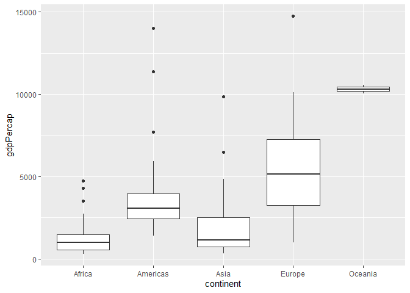
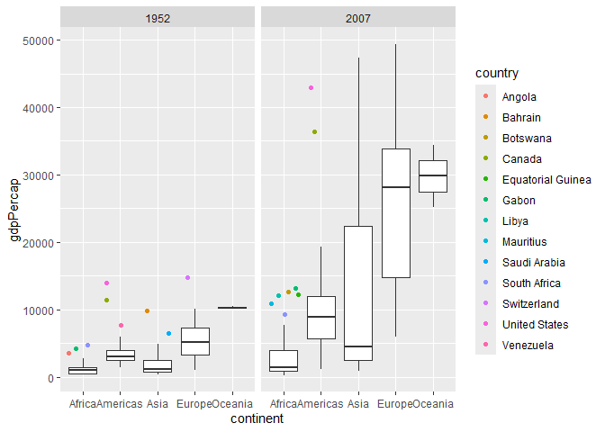

Gapminder
================
(Your name here)
2020-

- [Grading Rubric](#grading-rubric)
  - [Individual](#individual)
  - [Submission](#submission)
- [Guided EDA](#guided-eda)
  - [**q0** Perform your “first checks” on the dataset. What variables
    are in this
    dataset?](#q0-perform-your-first-checks-on-the-dataset-what-variables-are-in-this-dataset)
  - [**q1** Determine the most and least recent years in the `gapminder`
    dataset.](#q1-determine-the-most-and-least-recent-years-in-the-gapminder-dataset)
  - [**q2** Filter on years matching `year_min`, and make a plot of the
    GDP per capita against continent. Choose an appropriate `geom_` to
    visualize the data. What observations can you
    make?](#q2-filter-on-years-matching-year_min-and-make-a-plot-of-the-gdp-per-capita-against-continent-choose-an-appropriate-geom_-to-visualize-the-data-what-observations-can-you-make)
  - [**q3** You should have found *at least* three outliers in q2 (but
    possibly many more!). Identify those outliers (figure out which
    countries they
    are).](#q3-you-should-have-found-at-least-three-outliers-in-q2-but-possibly-many-more-identify-those-outliers-figure-out-which-countries-they-are)
  - [**q4** Create a plot similar to yours from q2 studying both
    `year_min` and `year_max`. Find a way to highlight the outliers from
    q3 on your plot *in a way that lets you identify which country is
    which*. Compare the patterns between `year_min` and
    `year_max`.](#q4-create-a-plot-similar-to-yours-from-q2-studying-both-year_min-and-year_max-find-a-way-to-highlight-the-outliers-from-q3-on-your-plot-in-a-way-that-lets-you-identify-which-country-is-which-compare-the-patterns-between-year_min-and-year_max)
- [Your Own EDA](#your-own-eda)
  - [**q5** Create *at least* three new figures below. With each figure,
    try to pose new questions about the
    data.](#q5-create-at-least-three-new-figures-below-with-each-figure-try-to-pose-new-questions-about-the-data)

*Purpose*: Learning to do EDA well takes practice! In this challenge
you’ll further practice EDA by first completing a guided exploration,
then by conducting your own investigation. This challenge will also give
you a chance to use the wide variety of visual tools we’ve been
learning.

<!-- include-rubric -->

# Grading Rubric

<!-- -------------------------------------------------- -->

Unlike exercises, **challenges will be graded**. The following rubrics
define how you will be graded, both on an individual and team basis.

## Individual

<!-- ------------------------- -->

| Category | Needs Improvement | Satisfactory |
|----|----|----|
| Effort | Some task **q**’s left unattempted | All task **q**’s attempted |
| Observed | Did not document observations, or observations incorrect | Documented correct observations based on analysis |
| Supported | Some observations not clearly supported by analysis | All observations clearly supported by analysis (table, graph, etc.) |
| Assessed | Observations include claims not supported by the data, or reflect a level of certainty not warranted by the data | Observations are appropriately qualified by the quality & relevance of the data and (in)conclusiveness of the support |
| Specified | Uses the phrase “more data are necessary” without clarification | Any statement that “more data are necessary” specifies which *specific* data are needed to answer what *specific* question |
| Code Styled | Violations of the [style guide](https://style.tidyverse.org/) hinder readability | Code sufficiently close to the [style guide](https://style.tidyverse.org/) |

## Submission

<!-- ------------------------- -->

Make sure to commit both the challenge report (`report.md` file) and
supporting files (`report_files/` folder) when you are done! Then submit
a link to Canvas. **Your Challenge submission is not complete without
all files uploaded to GitHub.**

``` r
library(tidyverse)
```

    ## ── Attaching core tidyverse packages ──────────────────────── tidyverse 2.0.0 ──
    ## ✔ dplyr     1.1.4     ✔ readr     2.1.5
    ## ✔ forcats   1.0.0     ✔ stringr   1.5.1
    ## ✔ ggplot2   3.5.1     ✔ tibble    3.2.1
    ## ✔ lubridate 1.9.4     ✔ tidyr     1.3.1
    ## ✔ purrr     1.0.2     
    ## ── Conflicts ────────────────────────────────────────── tidyverse_conflicts() ──
    ## ✖ dplyr::filter() masks stats::filter()
    ## ✖ dplyr::lag()    masks stats::lag()
    ## ℹ Use the conflicted package (<http://conflicted.r-lib.org/>) to force all conflicts to become errors

``` r
library(gapminder)
library(ggrepel)
```

*Background*: [Gapminder](https://www.gapminder.org/about-gapminder/) is
an independent organization that seeks to educate people about the state
of the world. They seek to counteract the worldview constructed by a
hype-driven media cycle, and promote a “fact-based worldview” by
focusing on data. The dataset we’ll study in this challenge is from
Gapminder.

# Guided EDA

<!-- -------------------------------------------------- -->

First, we’ll go through a round of *guided EDA*. Try to pay attention to
the high-level process we’re going through—after this guided round
you’ll be responsible for doing another cycle of EDA on your own!

### **q0** Perform your “first checks” on the dataset. What variables are in this dataset?

``` r
gapminder 
```

    ## # A tibble: 1,704 × 6
    ##    country     continent  year lifeExp      pop gdpPercap
    ##    <fct>       <fct>     <int>   <dbl>    <int>     <dbl>
    ##  1 Afghanistan Asia       1952    28.8  8425333      779.
    ##  2 Afghanistan Asia       1957    30.3  9240934      821.
    ##  3 Afghanistan Asia       1962    32.0 10267083      853.
    ##  4 Afghanistan Asia       1967    34.0 11537966      836.
    ##  5 Afghanistan Asia       1972    36.1 13079460      740.
    ##  6 Afghanistan Asia       1977    38.4 14880372      786.
    ##  7 Afghanistan Asia       1982    39.9 12881816      978.
    ##  8 Afghanistan Asia       1987    40.8 13867957      852.
    ##  9 Afghanistan Asia       1992    41.7 16317921      649.
    ## 10 Afghanistan Asia       1997    41.8 22227415      635.
    ## # ℹ 1,694 more rows

**Observations**:

- Country, Continent, Year, Life Expectancy, Population, GDP Per Capita

### **q1** Determine the most and least recent years in the `gapminder` dataset.

*Hint*: Use the `pull()` function to get a vector out of a tibble.
(Rather than the `$` notation of base R.)

``` r
## TASK: Find the largest and smallest values of `year` in `gapminder`
year_max <- 
  gapminder %>%
  pull(year) %>%
  max()
  
year_min <- 
  gapminder %>%
  pull(year) %>%
  min()
year_max
```

    ## [1] 2007

``` r
year_min
```

    ## [1] 1952

Use the following test to check your work.

``` r
## NOTE: No need to change this
assertthat::assert_that(year_max %% 7 == 5)
```

    ## [1] TRUE

``` r
assertthat::assert_that(year_max %% 3 == 0)
```

    ## [1] TRUE

``` r
assertthat::assert_that(year_min %% 7 == 6)
```

    ## [1] TRUE

``` r
assertthat::assert_that(year_min %% 3 == 2)
```

    ## [1] TRUE

``` r
if (is_tibble(year_max)) {
  print("year_max is a tibble; try using `pull()` to get a vector")
  assertthat::assert_that(False)
}

print("Nice!")
```

    ## [1] "Nice!"

### **q2** Filter on years matching `year_min`, and make a plot of the GDP per capita against continent. Choose an appropriate `geom_` to visualize the data. What observations can you make?

You may encounter difficulties in visualizing these data; if so document
your challenges and attempt to produce the most informative visual you
can.

``` r
## TASK: Create a visual of gdpPercap vs continent
gapminder %>%
  filter(
    year == year_min,
    gdpPercap < 90000,
  ) %>%
  ggplot + 
  geom_point(aes(x=continent, y = gdpPercap))
```

<!-- -->

``` r
gapminder %>%
  filter(
    year == year_min,
  ) %>%
  ggplot + 
  geom_point(aes(x=continent, y = gdpPercap)) + scale_y_log10()
```

<!-- -->

**Observations**: - For the first graph, an outlier from the dataset
that was in the continent of Asia was removed to allow for the rest of
the data set to be better spread and clear

- The two countries in Oceania are close to the GDP of Europe
- Apart from the outlier country in Asia, both the continents of Africa
  and Asia have lower GDPs per Capita which tracks with historical
  context of both of these continents
- The Americas are grouped together, which is something I have not seen
  often. I think it would be interesting to see the spread when the
  Americas are separated between North America and South America. I also
  wonder how much the mean is being pulled by the upper points in the
  Americas versus the rest of the data points.

**Difficulties & Approaches**:

- There was one country in Asia that was an outlier in the data set. It
  had a GDP Per Capita of above 90,000. Including this point in the
  graph made the rest of the data visualization cluster together at the
  bottom and no spread was identifiable
- As a result I excluded data points, which was just the one point,
  greater than 90,000 in order to see the rest of the data more clearly.
- Another approach I also looked at was adding a log scale on the
  y-axis. This pulled the “outlier” point in towards the rest of the
  dataset and also made the bottom portion of the data set a lot
  clearer.
- I kept both visualizations in because I wanted to compare whether
  using a log axis or removing the outlier would show the separation
  between the points better without misrepresenting the data.

### **q3** You should have found *at least* three outliers in q2 (but possibly many more!). Identify those outliers (figure out which countries they are).

``` r
whisk_gapminder <-
  gapminder %>%
  filter(year == year_min, gdpPercap < 90000 ) %>%
  group_by(continent) %>%
  summarize(
    low_whisk = boxplot.stats(gdpPercap)$stats[1],
    high_whisk = boxplot.stats(gdpPercap)$stats[5]
  )
  
whisk_gapminder
```

    ## # A tibble: 5 × 3
    ##   continent low_whisk high_whisk
    ##   <fct>         <dbl>      <dbl>
    ## 1 Africa         299.      2719.
    ## 2 Americas      1398.      5911.
    ## 3 Asia           331       4835.
    ## 4 Europe         974.     10095.
    ## 5 Oceania      10040.     10557.

``` r
filt_gapminder <-
  gapminder %>%
  filter(year==year_min, gdpPercap < 90000) %>%
  left_join(whisk_gapminder, by = "continent") %>%
  mutate(in_range = gdpPercap >= low_whisk & gdpPercap <= high_whisk)

filt_gapminder
```

    ## # A tibble: 141 × 9
    ##    country     continent  year lifeExp      pop gdpPercap low_whisk high_whisk
    ##    <fct>       <fct>     <int>   <dbl>    <int>     <dbl>     <dbl>      <dbl>
    ##  1 Afghanistan Asia       1952    28.8  8425333      779.      331       4835.
    ##  2 Albania     Europe     1952    55.2  1282697     1601.      974.     10095.
    ##  3 Algeria     Africa     1952    43.1  9279525     2449.      299.      2719.
    ##  4 Angola      Africa     1952    30.0  4232095     3521.      299.      2719.
    ##  5 Argentina   Americas   1952    62.5 17876956     5911.     1398.      5911.
    ##  6 Australia   Oceania    1952    69.1  8691212    10040.    10040.     10557.
    ##  7 Austria     Europe     1952    66.8  6927772     6137.      974.     10095.
    ##  8 Bahrain     Asia       1952    50.9   120447     9867.      331       4835.
    ##  9 Bangladesh  Asia       1952    37.5 46886859      684.      331       4835.
    ## 10 Belgium     Europe     1952    68    8730405     8343.      974.     10095.
    ## # ℹ 131 more rows
    ## # ℹ 1 more variable: in_range <lgl>

``` r
ggplot(
  filt_gapminder,
  aes(continent, gdpPercap)
) + geom_boxplot(outlier.shape = NA) +
  geom_jitter(data = filt_gapminder %>% 
    filter(in_range == FALSE),
    aes(color=country))
```

<!-- -->

**Observations**:

- There were ten total outliers based on this graph
- I determined outliers based on using the box and whisker plot
  statistics. The values that were beyond the low whisker and upper
  whisker were considered outliers because they were relatively distant
  from the bulk distribution of the continent.
- I filtered out the one largest outlier, that was greater than 90000,
  because it would make the rest of the point illegible as well as skew
  the boxplots -I think it’s really interesting how the outliers are all
  above the high whisker and not below, I think this might be because of
  the proportionally large number of countries within a continent that
  are below the average GDP per capita of that continent and the very
  few countries who do have a high GDP per capita are significantly
  greater
- Filtering this data does make me wonder how much taking an outlier
  away from the data changes the accuracy of the box and whisker plots
  or any other statistical analysis being done.

*Hint*: For the next task, it’s helpful to know a ggplot trick we’ll
learn in an upcoming exercise: You can use the `data` argument inside
any `geom_*` to modify the data that will be plotted *by that geom
only*. For instance, you can use this trick to filter a set of points to
label:

``` r
## NOTE: No need to edit, use ideas from this in q4 below
gapminder %>%
  filter(year == max(year)) %>%

  ggplot(aes(continent, lifeExp)) +
  geom_boxplot() +
  geom_point(
    data = . %>% filter(country %in% c("United Kingdom", "Japan", "Zambia")),
    mapping = aes(color = country),
    size = 2
  )
```

<!-- -->

### **q4** Create a plot similar to yours from q2 studying both `year_min` and `year_max`. Find a way to highlight the outliers from q3 on your plot *in a way that lets you identify which country is which*. Compare the patterns between `year_min` and `year_max`.

*Hint*: We’ve learned a lot of different ways to show multiple
variables; think about using different aesthetics or facets.

``` r
whiskmin_gapminder <-
  gapminder %>%
  filter(year == year_min, gdpPercap < 90000 ) %>%
  group_by(continent) %>%
  summarize(
    low_min_whisk = boxplot.stats(gdpPercap)$stats[1],
    high_min_whisk = boxplot.stats(gdpPercap)$stats[5]
  )
  


whiskmax_gapminder <-
  gapminder %>%
  filter(year == year_max, gdpPercap < 90000 ) %>%
  group_by(continent) %>%
  summarize(
    low_max_whisk = boxplot.stats(gdpPercap)$stats[1],
    high_max_whisk = boxplot.stats(gdpPercap)$stats[5]
  )
  


all_whisk <-
  whiskmin_gapminder %>%
  left_join(whiskmax_gapminder, by = "continent")


df<-
  gapminder %>%
  filter(year %in% c(1952, 2007)) %>%
  filter(gdpPercap < 90000) %>%
  left_join(all_whisk, by = "continent") %>%
  
  mutate(
    min_in_range = case_when(
      year == 1952 ~ gdpPercap >= low_min_whisk & gdpPercap <= high_min_whisk,
    TRUE ~ NA),
    max_in_range = case_when(
      year == 2007 ~ gdpPercap >= low_max_whisk & gdpPercap <= high_max_whisk,
   TRUE ~ NA)
        )

ggplot(df, aes(continent, gdpPercap)) +
  geom_boxplot(outlier.shape = NA) +
  geom_jitter(data = df %>%
    filter((year == 1952 & min_in_range == FALSE) | (year == 2007 & max_in_range == FALSE)),
    aes(color=country)) +
    facet_wrap(~year)
```

<!-- -->

**Observations**:

\- I think it is really interesting how in 2007 the whiskers for the box
and whisker plot were significantly longer in Asia and Europe than in
1952. This may be a result of a general growth and larger spread of GDP
per capita for countries in the 2000s compared to 1952.

\- Much like the previous graph, there are no outliers below the lower
whiskers for any year or country - It’s also interesting and only four
countries remained outliers, above the GDP per Capita of the continent,
in 1952 and 2007. These countries were Gabon, South Africa, United
States, and Canada

\- While all of the outliers shown are outliers amongst their continent,
it’s interesting to see how far apart the outliers are from each other.
Gabon is an oulier with a higher GDP of the rest of Africa with a GDP
per Capita of a little under 9000 while Canada is the lowest outlier in
the Americas with a GDP per Capita of 35000 in 2007.

# Your Own EDA

<!-- -------------------------------------------------- -->

Now it’s your turn! We just went through guided EDA considering the GDP
per capita at two time points. You can continue looking at outliers,
consider different years, repeat the exercise with `lifeExp`, consider
the relationship between variables, or something else entirely.

### **q5** Create *at least* three new figures below. With each figure, try to pose new questions about the data.

``` r
## 
filtnine_gapminder <-
  gapminder %>%
  filter(year == year_min, continent == "Asia", gdpPercap < 90000 ) %>%
  group_by(continent) %>%
  summarize(
    Q1 = boxplot.stats(gdpPercap)$stats[1],
    Q2 = boxplot.stats(gdpPercap)$stats[2],
    Q3 = boxplot.stats(gdpPercap)$stats[3],
    Lower_Whisker = boxplot.stats(gdpPercap)$stats[4],
    Upper_Whisker = boxplot.stats(gdpPercap)$stats[5],
    .groups = "drop") %>%
    mutate(Type = "Filtered")
    


nofilt_gapminder <-
  gapminder %>%
  filter(year == year_min, continent == "Asia") %>%
  group_by(continent) %>%
  summarize(
    Q1 = boxplot.stats(gdpPercap)$stats[1],
    Q2 = boxplot.stats(gdpPercap)$stats[2],
    Q3 = boxplot.stats(gdpPercap)$stats[3],
    Lower_Whisker = boxplot.stats(gdpPercap)$stats[4],
    Upper_Whisker = boxplot.stats(gdpPercap)$stats[5],
    .groups = "drop")%>%

    mutate(Type = "Unfiltered")
    

both_gapminder <-
  bind_rows(filtnine_gapminder, nofilt_gapminder)

gap_minder_long <-
both_gapminder %>%
  pivot_longer(
    cols = c(Q1, Q2, Q3, Lower_Whisker, Upper_Whisker),
    names_to = "Statistic",
    values_to = "GDP_Values"
  )
gap_minder_long
```

    ## # A tibble: 10 × 4
    ##    continent Type       Statistic     GDP_Values
    ##    <fct>     <chr>      <chr>              <dbl>
    ##  1 Asia      Filtered   Q1                  331 
    ##  2 Asia      Filtered   Q2                  717.
    ##  3 Asia      Filtered   Q3                 1148.
    ##  4 Asia      Filtered   Lower_Whisker      2675.
    ##  5 Asia      Filtered   Upper_Whisker      4835.
    ##  6 Asia      Unfiltered Q1                  331 
    ##  7 Asia      Unfiltered Q2                  750.
    ##  8 Asia      Unfiltered Q3                 1207.
    ##  9 Asia      Unfiltered Lower_Whisker      3035.
    ## 10 Asia      Unfiltered Upper_Whisker      6460.

``` r
bar_plot <-
  ggplot(gap_minder_long, aes(x = Statistic, y = GDP_Values, fill = Type)) +
  geom_col(position = "dodge")
bar_plot
```

<!-- -->

- How much do the box and whisker plot values change when you do or
  don’t filter out the outlier?
- It is interesting that the Q1 values across both are identical, and
  the Q2 and Q3 values are not that different from each other but the
  whiskers are significantly different
- I believe this is because there’s is only one point being filtered
  out, so for calculating the quartiles, the quantities are not skewed
  much
- The whisker values for the data without the outlier point removed were
  both greater because that outlier is pulling the values up.

``` r
## TASK: Your second graph
us_gdp <-
  gapminder %>%
  filter(country == "United States")
us_gdp
```

    ## # A tibble: 12 × 6
    ##    country       continent  year lifeExp       pop gdpPercap
    ##    <fct>         <fct>     <int>   <dbl>     <int>     <dbl>
    ##  1 United States Americas   1952    68.4 157553000    13990.
    ##  2 United States Americas   1957    69.5 171984000    14847.
    ##  3 United States Americas   1962    70.2 186538000    16173.
    ##  4 United States Americas   1967    70.8 198712000    19530.
    ##  5 United States Americas   1972    71.3 209896000    21806.
    ##  6 United States Americas   1977    73.4 220239000    24073.
    ##  7 United States Americas   1982    74.6 232187835    25010.
    ##  8 United States Americas   1987    75.0 242803533    29884.
    ##  9 United States Americas   1992    76.1 256894189    32004.
    ## 10 United States Americas   1997    76.8 272911760    35767.
    ## 11 United States Americas   2002    77.3 287675526    39097.
    ## 12 United States Americas   2007    78.2 301139947    42952.

``` r
ggplot(us_gdp, aes(year, gdpPercap))+
  geom_point()
```

<!-- -->

- How has the GDP per Capita of the United States changed over time and
  can it be mapped to historical events?
- It seems like there has been a linear growth of the GDP Per Capita of
  the United States from the years 1950 to 2007
- Having more data would make this plot much more informative. Since
  there is only one data point every 5 years, the trend between years
  gets lost. However, for this case it may not affect it as much since I
  don’t believe a country’s GDP per Capita can change that significantly
  within five years
- Additionally, have more recent data, even just 2008, would be really
  interesting to see if the 2008 recession had a significant impact on
  the country’s GDP
- In 1982 we see a data point that doesn’t follow the linear trend.
  After doing some extra research I discovered that there was a
  significant recession, the worst since the Great Depression, from July
  1981 to November 1982. This was caused by tight monetary regulation
  that was in an effort to fight the rising inflation.
- It would be interesting to see if there were global economic declines
  during this time period by mapping the world’s economically leading
  countries and seeing if there is a year where they all drop.

``` r
f_gap <-
  gapminder %>%
  filter(gdpPercap < 50000)

  ggplot(f_gap, aes(gdpPercap,lifeExp, color = continent))+
  geom_point() +
  facet_wrap(~year)
```

<!-- -->

- Are the GDP and life expectancy correlated in any way?

- For each year, it does not seem like there is a trend between the GDP
  per capita of a country and their life expectancy

- It seems more like when the country’s GDP per capita is below 50000,
  there is a larger spread of life expentance of the country. However,
  as the country’s GDP per Capita hits 10,000, the life expectancy is
  generally above 60

- This trend is more clearly seen in the more recent years as the GDP
  per Capita has increased. As the GDP per capita gets higher, the
  spread of the life expectancy values decreases and there are no
  countries whose life expectancy is below 70

- I think it’s interesting how over time the locations of the coloring
  of each continent has not changed in relation to each other. Africa
  stays towards the bottom left in the span of 55 years while the
  European countries remain towards the top in life expectancy and GDP
  per Capita.
