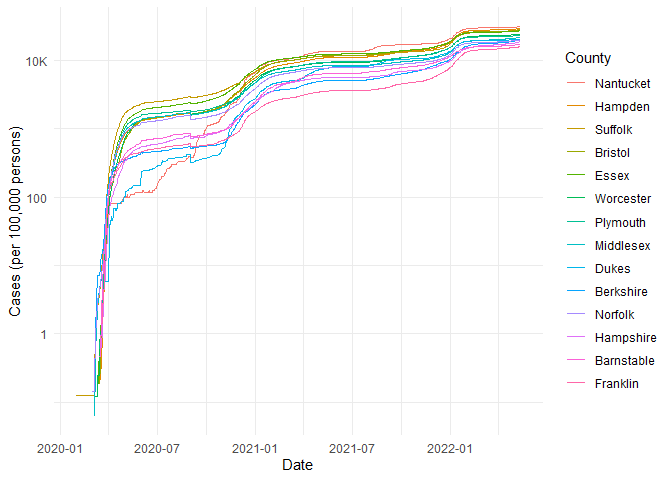
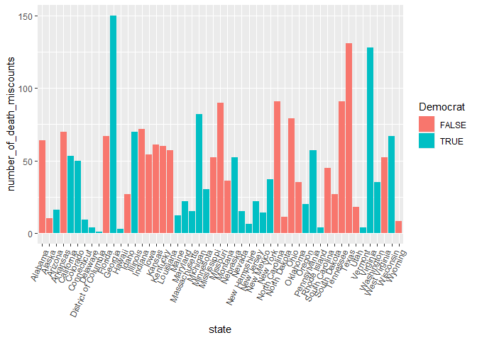

COVID-19
================
(Your name here)
2020-

- [Grading Rubric](#grading-rubric)
  - [Individual](#individual)
  - [Submission](#submission)
- [The Big Picture](#the-big-picture)
- [Get the Data](#get-the-data)
  - [Navigating the Census Bureau](#navigating-the-census-bureau)
    - [**q1** Load Table `B01003` into the following tibble. Make sure
      the column names are
      `id, Geographic Area Name, Estimate!!Total, Margin of Error!!Total`.](#q1-load-table-b01003-into-the-following-tibble-make-sure-the-column-names-are-id-geographic-area-name-estimatetotal-margin-of-errortotal)
  - [Automated Download of NYT Data](#automated-download-of-nyt-data)
    - [**q2** Visit the NYT GitHub repo and find the URL for the **raw**
      US County-level data. Assign that URL as a string to the variable
      below.](#q2-visit-the-nyt-github-repo-and-find-the-url-for-the-raw-us-county-level-data-assign-that-url-as-a-string-to-the-variable-below)
- [Join the Data](#join-the-data)
  - [**q3** Process the `id` column of `df_pop` to create a `fips`
    column.](#q3-process-the-id-column-of-df_pop-to-create-a-fips-column)
  - [**q4** Join `df_covid` with `df_q3` by the `fips` column. Use the
    proper type of join to preserve *only* the rows in
    `df_covid`.](#q4-join-df_covid-with-df_q3-by-the-fips-column-use-the-proper-type-of-join-to-preserve-only-the-rows-in-df_covid)
- [Analyze](#analyze)
  - [Normalize](#normalize)
    - [**q5** Use the `population` estimates in `df_data` to normalize
      `cases` and `deaths` to produce per 100,000 counts \[3\]. Store
      these values in the columns `cases_per100k` and
      `deaths_per100k`.](#q5-use-the-population-estimates-in-df_data-to-normalize-cases-and-deaths-to-produce-per-100000-counts-3-store-these-values-in-the-columns-cases_per100k-and-deaths_per100k)
  - [Guided EDA](#guided-eda)
    - [**q6** Compute some summaries](#q6-compute-some-summaries)
    - [**q7** Find and compare the top
      10](#q7-find-and-compare-the-top-10)
  - [Self-directed EDA](#self-directed-eda)
    - [**q8** Drive your own ship: You’ve just put together a very rich
      dataset; you now get to explore! Pick your own direction and
      generate at least one punchline figure to document an interesting
      finding. I give a couple tips & ideas
      below:](#q8-drive-your-own-ship-youve-just-put-together-a-very-rich-dataset-you-now-get-to-explore-pick-your-own-direction-and-generate-at-least-one-punchline-figure-to-document-an-interesting-finding-i-give-a-couple-tips--ideas-below)
    - [Ideas](#ideas)
    - [Aside: Some visualization
      tricks](#aside-some-visualization-tricks)
    - [Geographic exceptions](#geographic-exceptions)
- [Notes](#notes)

*Purpose*: In this challenge, you’ll learn how to navigate the U.S.
Census Bureau website, programmatically download data from the internet,
and perform a county-level population-weighted analysis of current
COVID-19 trends. This will give you the base for a very deep
investigation of COVID-19, which we’ll build upon for Project 1.

<!-- include-rubric -->

# Grading Rubric

<!-- -------------------------------------------------- -->

Unlike exercises, **challenges will be graded**. The following rubrics
define how you will be graded, both on an individual and team basis.

## Individual

<!-- ------------------------- -->

| Category | Needs Improvement | Satisfactory |
|----|----|----|
| Effort | Some task **q**’s left unattempted | All task **q**’s attempted |
| Observed | Did not document observations, or observations incorrect | Documented correct observations based on analysis |
| Supported | Some observations not clearly supported by analysis | All observations clearly supported by analysis (table, graph, etc.) |
| Assessed | Observations include claims not supported by the data, or reflect a level of certainty not warranted by the data | Observations are appropriately qualified by the quality & relevance of the data and (in)conclusiveness of the support |
| Specified | Uses the phrase “more data are necessary” without clarification | Any statement that “more data are necessary” specifies which *specific* data are needed to answer what *specific* question |
| Code Styled | Violations of the [style guide](https://style.tidyverse.org/) hinder readability | Code sufficiently close to the [style guide](https://style.tidyverse.org/) |

## Submission

<!-- ------------------------- -->

Make sure to commit both the challenge report (`report.md` file) and
supporting files (`report_files/` folder) when you are done! Then submit
a link to Canvas. **Your Challenge submission is not complete without
all files uploaded to GitHub.**

``` r
library(tidyverse)
```

    ## ── Attaching core tidyverse packages ──────────────────────── tidyverse 2.0.0 ──
    ## ✔ dplyr     1.1.4     ✔ readr     2.1.5
    ## ✔ forcats   1.0.0     ✔ stringr   1.5.1
    ## ✔ ggplot2   3.5.1     ✔ tibble    3.2.1
    ## ✔ lubridate 1.9.4     ✔ tidyr     1.3.1
    ## ✔ purrr     1.0.2     
    ## ── Conflicts ────────────────────────────────────────── tidyverse_conflicts() ──
    ## ✖ dplyr::filter() masks stats::filter()
    ## ✖ dplyr::lag()    masks stats::lag()
    ## ℹ Use the conflicted package (<http://conflicted.r-lib.org/>) to force all conflicts to become errors

*Background*:
[COVID-19](https://en.wikipedia.org/wiki/Coronavirus_disease_2019) is
the disease caused by the virus SARS-CoV-2. In 2020 it became a global
pandemic, leading to huge loss of life and tremendous disruption to
society. The New York Times (as of writing) publishes up-to-date data on
the progression of the pandemic across the United States—we will study
these data in this challenge.

*Optional Readings*: I’ve found this [ProPublica
piece](https://www.propublica.org/article/how-to-understand-covid-19-numbers)
on “How to understand COVID-19 numbers” to be very informative!

# The Big Picture

<!-- -------------------------------------------------- -->

We’re about to go through *a lot* of weird steps, so let’s first fix the
big picture firmly in mind:

We want to study COVID-19 in terms of data: both case counts (number of
infections) and deaths. We’re going to do a county-level analysis in
order to get a high-resolution view of the pandemic. Since US counties
can vary widely in terms of their population, we’ll need population
estimates in order to compute infection rates (think back to the
`Titanic` challenge).

That’s the high-level view; now let’s dig into the details.

# Get the Data

<!-- -------------------------------------------------- -->

1.  County-level population estimates (Census Bureau)
2.  County-level COVID-19 counts (New York Times)

## Navigating the Census Bureau

<!-- ------------------------- -->

**Steps**: Our objective is to find the 2018 American Community
Survey\[1\] (ACS) Total Population estimates, disaggregated by counties.
To check your results, this is Table `B01003`.

1.  Go to [data.census.gov](data.census.gov).
2.  Scroll down and click `View Tables`.
3.  Apply filters to find the ACS **Total Population** estimates,
    disaggregated by counties. I used the filters:

- `Topics > Populations and People > Counts, Estimates, and Projections > Population Total`
- `Geography > County > All counties in United States`

5.  Select the **Total Population** table and click the `Download`
    button to download the data; make sure to select the 2018 5-year
    estimates.
6.  Unzip and move the data to your `challenges/data` folder.

- Note that the data will have a crazy-long filename like
  `ACSDT5Y2018.B01003_data_with_overlays_2020-07-26T094857.csv`. That’s
  because metadata is stored in the filename, such as the year of the
  estimate (`Y2018`) and my access date (`2020-07-26`). **Your filename
  will vary based on when you download the data**, so make sure to copy
  the filename that corresponds to what you downloaded!

### **q1** Load Table `B01003` into the following tibble. Make sure the column names are `id, Geographic Area Name, Estimate!!Total, Margin of Error!!Total`.

*Hint*: You will need to use the `skip` keyword when loading these data!

``` r
## TASK: Load the census bureau data with the following tibble name.

files <- list.files("C:\\Users\\bdeshpande\\Documents\\Data Science\\data-science-s2025\\challenges\\data\\BACSDT5Y2018.B01003_2025-03-09T104506", full.names = TRUE)

df_pop <- 
  read_csv(files[2], skip = 1)
```

    ## New names:
    ## Rows: 3220 Columns: 5
    ## ── Column specification
    ## ──────────────────────────────────────────────────────── Delimiter: "," chr
    ## (3): Geography, Geographic Area Name, Margin of Error!!Total dbl (1):
    ## Estimate!!Total lgl (1): ...5
    ## ℹ Use `spec()` to retrieve the full column specification for this data. ℹ
    ## Specify the column types or set `show_col_types = FALSE` to quiet this message.
    ## • `` -> `...5`

``` r
df_pop <- df_pop[, -5] 
colnames(df_pop) <- c("id", "Geographic Area Name", "Estimate!!Total", "Margin of Error!!Total")
df_pop
```

    ## # A tibble: 3,220 × 4
    ##    id            `Geographic Area Name` `Estimate!!Total` Margin of Error!!Tot…¹
    ##    <chr>         <chr>                              <dbl> <chr>                 
    ##  1 0500000US010… Autauga County, Alaba…             55200 *****                 
    ##  2 0500000US010… Baldwin County, Alaba…            208107 *****                 
    ##  3 0500000US010… Barbour County, Alaba…             25782 *****                 
    ##  4 0500000US010… Bibb County, Alabama               22527 *****                 
    ##  5 0500000US010… Blount County, Alabama             57645 *****                 
    ##  6 0500000US010… Bullock County, Alaba…             10352 *****                 
    ##  7 0500000US010… Butler County, Alabama             20025 *****                 
    ##  8 0500000US010… Calhoun County, Alaba…            115098 *****                 
    ##  9 0500000US010… Chambers County, Alab…             33826 *****                 
    ## 10 0500000US010… Cherokee County, Alab…             25853 *****                 
    ## # ℹ 3,210 more rows
    ## # ℹ abbreviated name: ¹​`Margin of Error!!Total`

*Note*: You can find information on 1-year, 3-year, and 5-year estimates
[here](https://www.census.gov/programs-surveys/acs/guidance/estimates.html).
The punchline is that 5-year estimates are more reliable but less
current.

## Automated Download of NYT Data

<!-- ------------------------- -->

ACS 5-year estimates don’t change all that often, but the COVID-19 data
are changing rapidly. To that end, it would be nice to be able to
*programmatically* download the most recent data for analysis; that way
we can update our analysis whenever we want simply by re-running our
notebook. This next problem will have you set up such a pipeline.

The New York Times is publishing up-to-date data on COVID-19 on
[GitHub](https://github.com/nytimes/covid-19-data).

### **q2** Visit the NYT [GitHub](https://github.com/nytimes/covid-19-data) repo and find the URL for the **raw** US County-level data. Assign that URL as a string to the variable below.

``` r
## TASK: Find the URL for the NYT covid-19 county-level data
url_counties <- "https://raw.githubusercontent.com/nytimes/covid-19-data/refs/heads/master/us-counties.csv"
```

Once you have the url, the following code will download a local copy of
the data, then load the data into R.

``` r
## NOTE: No need to change this; just execute
## Set the filename of the data to download
filename_nyt <- "./data/nyt_counties.csv"

## Download the data locally
curl::curl_download(
        url_counties,
        destfile = filename_nyt
      )

## Loads the downloaded csv
df_covid <- read_csv(filename_nyt)
```

    ## Rows: 2502832 Columns: 6
    ## ── Column specification ────────────────────────────────────────────────────────
    ## Delimiter: ","
    ## chr  (3): county, state, fips
    ## dbl  (2): cases, deaths
    ## date (1): date
    ## 
    ## ℹ Use `spec()` to retrieve the full column specification for this data.
    ## ℹ Specify the column types or set `show_col_types = FALSE` to quiet this message.

``` r
df_covid
```

    ## # A tibble: 2,502,832 × 6
    ##    date       county      state      fips  cases deaths
    ##    <date>     <chr>       <chr>      <chr> <dbl>  <dbl>
    ##  1 2020-01-21 Snohomish   Washington 53061     1      0
    ##  2 2020-01-22 Snohomish   Washington 53061     1      0
    ##  3 2020-01-23 Snohomish   Washington 53061     1      0
    ##  4 2020-01-24 Cook        Illinois   17031     1      0
    ##  5 2020-01-24 Snohomish   Washington 53061     1      0
    ##  6 2020-01-25 Orange      California 06059     1      0
    ##  7 2020-01-25 Cook        Illinois   17031     1      0
    ##  8 2020-01-25 Snohomish   Washington 53061     1      0
    ##  9 2020-01-26 Maricopa    Arizona    04013     1      0
    ## 10 2020-01-26 Los Angeles California 06037     1      0
    ## # ℹ 2,502,822 more rows

You can now re-run the chunk above (or the entire notebook) to pull the
most recent version of the data. Thus you can periodically re-run this
notebook to check in on the pandemic as it evolves.

*Note*: You should feel free to copy-paste the code above for your own
future projects!

# Join the Data

<!-- -------------------------------------------------- -->

To get a sense of our task, let’s take a glimpse at our two data
sources.

``` r
## NOTE: No need to change this; just execute
df_pop %>% glimpse
```

    ## Rows: 3,220
    ## Columns: 4
    ## $ id                       <chr> "0500000US01001", "0500000US01003", "0500000U…
    ## $ `Geographic Area Name`   <chr> "Autauga County, Alabama", "Baldwin County, A…
    ## $ `Estimate!!Total`        <dbl> 55200, 208107, 25782, 22527, 57645, 10352, 20…
    ## $ `Margin of Error!!Total` <chr> "*****", "*****", "*****", "*****", "*****", …

``` r
df_covid %>% glimpse
```

    ## Rows: 2,502,832
    ## Columns: 6
    ## $ date   <date> 2020-01-21, 2020-01-22, 2020-01-23, 2020-01-24, 2020-01-24, 20…
    ## $ county <chr> "Snohomish", "Snohomish", "Snohomish", "Cook", "Snohomish", "Or…
    ## $ state  <chr> "Washington", "Washington", "Washington", "Illinois", "Washingt…
    ## $ fips   <chr> "53061", "53061", "53061", "17031", "53061", "06059", "17031", …
    ## $ cases  <dbl> 1, 1, 1, 1, 1, 1, 1, 1, 1, 1, 1, 1, 1, 1, 1, 1, 1, 1, 1, 1, 1, …
    ## $ deaths <dbl> 0, 0, 0, 0, 0, 0, 0, 0, 0, 0, 0, 0, 0, 0, 0, 0, 0, 0, 0, 0, 0, …

To join these datasets, we’ll need to use [FIPS county
codes](https://en.wikipedia.org/wiki/FIPS_county_code).\[2\] The last
`5` digits of the `id` column in `df_pop` is the FIPS county code, while
the NYT data `df_covid` already contains the `fips`.

### **q3** Process the `id` column of `df_pop` to create a `fips` column.

``` r
## TASK: Create a `fips` c(olumn by extracting the county code
df_q3 <- 
  df_pop %>%
  mutate(fips = str_sub(id, -5))
df_q3
```

    ## # A tibble: 3,220 × 5
    ##    id      `Geographic Area Name` `Estimate!!Total` Margin of Error!!Tot…¹ fips 
    ##    <chr>   <chr>                              <dbl> <chr>                  <chr>
    ##  1 050000… Autauga County, Alaba…             55200 *****                  01001
    ##  2 050000… Baldwin County, Alaba…            208107 *****                  01003
    ##  3 050000… Barbour County, Alaba…             25782 *****                  01005
    ##  4 050000… Bibb County, Alabama               22527 *****                  01007
    ##  5 050000… Blount County, Alabama             57645 *****                  01009
    ##  6 050000… Bullock County, Alaba…             10352 *****                  01011
    ##  7 050000… Butler County, Alabama             20025 *****                  01013
    ##  8 050000… Calhoun County, Alaba…            115098 *****                  01015
    ##  9 050000… Chambers County, Alab…             33826 *****                  01017
    ## 10 050000… Cherokee County, Alab…             25853 *****                  01019
    ## # ℹ 3,210 more rows
    ## # ℹ abbreviated name: ¹​`Margin of Error!!Total`

Use the following test to check your answer.

``` r
## NOTE: No need to change this
## Check known county
assertthat::assert_that(
              (df_q3 %>%
              filter(str_detect(`Geographic Area Name`, "Autauga County")) %>%
              pull(fips)) == "01001"
            )
```

    ## [1] TRUE

``` r
print("Very good!")
```

    ## [1] "Very good!"

### **q4** Join `df_covid` with `df_q3` by the `fips` column. Use the proper type of join to preserve *only* the rows in `df_covid`.

``` r
## TASK: Join df_covid and df_q3 by fips.
df_q4 <- 
  df_q3 %>%
  right_join(
    df_covid,
    df_q3,
    by = "fips"
  )
df_q4
```

    ## # A tibble: 2,502,832 × 10
    ##    id      `Geographic Area Name` `Estimate!!Total` Margin of Error!!Tot…¹ fips 
    ##    <chr>   <chr>                              <dbl> <chr>                  <chr>
    ##  1 050000… Autauga County, Alaba…             55200 *****                  01001
    ##  2 050000… Autauga County, Alaba…             55200 *****                  01001
    ##  3 050000… Autauga County, Alaba…             55200 *****                  01001
    ##  4 050000… Autauga County, Alaba…             55200 *****                  01001
    ##  5 050000… Autauga County, Alaba…             55200 *****                  01001
    ##  6 050000… Autauga County, Alaba…             55200 *****                  01001
    ##  7 050000… Autauga County, Alaba…             55200 *****                  01001
    ##  8 050000… Autauga County, Alaba…             55200 *****                  01001
    ##  9 050000… Autauga County, Alaba…             55200 *****                  01001
    ## 10 050000… Autauga County, Alaba…             55200 *****                  01001
    ## # ℹ 2,502,822 more rows
    ## # ℹ abbreviated name: ¹​`Margin of Error!!Total`
    ## # ℹ 5 more variables: date <date>, county <chr>, state <chr>, cases <dbl>,
    ## #   deaths <dbl>

Use the following test to check your answer.

``` r
## NOTE: No need to change this
if (!any(df_q4 %>% pull(fips) %>% str_detect(., "02105"), na.rm = TRUE)) {
  assertthat::assert_that(TRUE)
} else {
  print(str_c(
    "Your df_q4 contains a row for the Hoonah-Angoon Census Area (AK),",
    "which is not in df_covid. You used the incorrect join type.",
    sep = " "
  ))
  assertthat::assert_that(FALSE)
}
```

    ## [1] TRUE

``` r
if (any(df_q4 %>% pull(fips) %>% str_detect(., "78010"), na.rm = TRUE)) {
  assertthat::assert_that(TRUE)
} else {
  print(str_c(
    "Your df_q4 does not include St. Croix, US Virgin Islands,",
    "which is in df_covid. You used the incorrect join type.",
    sep = " "
  ))
  assertthat::assert_that(FALSE)
}
```

    ## [1] TRUE

``` r
print("Very good!")
```

    ## [1] "Very good!"

For convenience, I down-select some columns and produce more convenient
column names.

``` r
## NOTE: No need to change; run this to produce a more convenient tibble
df_data <-
  df_q4 %>%
  select(
    date,
    county,
    state,
    fips,
    cases,
    deaths,
    population = `Estimate!!Total`
  )
df_data
```

    ## # A tibble: 2,502,832 × 7
    ##    date       county  state   fips  cases deaths population
    ##    <date>     <chr>   <chr>   <chr> <dbl>  <dbl>      <dbl>
    ##  1 2020-03-24 Autauga Alabama 01001     1      0      55200
    ##  2 2020-03-25 Autauga Alabama 01001     4      0      55200
    ##  3 2020-03-26 Autauga Alabama 01001     6      0      55200
    ##  4 2020-03-27 Autauga Alabama 01001     6      0      55200
    ##  5 2020-03-28 Autauga Alabama 01001     6      0      55200
    ##  6 2020-03-29 Autauga Alabama 01001     6      0      55200
    ##  7 2020-03-30 Autauga Alabama 01001     7      0      55200
    ##  8 2020-03-31 Autauga Alabama 01001     7      0      55200
    ##  9 2020-04-01 Autauga Alabama 01001    10      0      55200
    ## 10 2020-04-02 Autauga Alabama 01001    10      0      55200
    ## # ℹ 2,502,822 more rows

# Analyze

<!-- -------------------------------------------------- -->

Now that we’ve done the hard work of loading and wrangling the data, we
can finally start our analysis. Our first step will be to produce county
population-normalized cases and death counts. Then we will explore the
data.

## Normalize

<!-- ------------------------- -->

### **q5** Use the `population` estimates in `df_data` to normalize `cases` and `deaths` to produce per 100,000 counts \[3\]. Store these values in the columns `cases_per100k` and `deaths_per100k`.

``` r
## TASK: Normalize cases and deaths
df_normalized <-
  df_data %>%
  mutate (
    cases_per100k = (cases / population) * 100000,
    deaths_per100k = (deaths / population) * 100000
    ) 
df_normalized
```

    ## # A tibble: 2,502,832 × 9
    ##    date       county  state   fips  cases deaths population cases_per100k
    ##    <date>     <chr>   <chr>   <chr> <dbl>  <dbl>      <dbl>         <dbl>
    ##  1 2020-03-24 Autauga Alabama 01001     1      0      55200          1.81
    ##  2 2020-03-25 Autauga Alabama 01001     4      0      55200          7.25
    ##  3 2020-03-26 Autauga Alabama 01001     6      0      55200         10.9 
    ##  4 2020-03-27 Autauga Alabama 01001     6      0      55200         10.9 
    ##  5 2020-03-28 Autauga Alabama 01001     6      0      55200         10.9 
    ##  6 2020-03-29 Autauga Alabama 01001     6      0      55200         10.9 
    ##  7 2020-03-30 Autauga Alabama 01001     7      0      55200         12.7 
    ##  8 2020-03-31 Autauga Alabama 01001     7      0      55200         12.7 
    ##  9 2020-04-01 Autauga Alabama 01001    10      0      55200         18.1 
    ## 10 2020-04-02 Autauga Alabama 01001    10      0      55200         18.1 
    ## # ℹ 2,502,822 more rows
    ## # ℹ 1 more variable: deaths_per100k <dbl>

You may use the following test to check your work.

``` r
## NOTE: No need to change this
## Check known county data
if (any(df_normalized %>% pull(date) %>% str_detect(., "2020-01-21"))) {
  assertthat::assert_that(TRUE)
} else {
  print(str_c(
    "Date 2020-01-21 not found; did you download the historical data (correct),",
    "or just the most recent data (incorrect)?",
    sep = " "
  ))
  assertthat::assert_that(FALSE)
}
```

    ## [1] TRUE

``` r
if (any(df_normalized %>% pull(date) %>% str_detect(., "2022-05-13"))) {
  assertthat::assert_that(TRUE)
} else {
  print(str_c(
    "Date 2022-05-13 not found; did you download the historical data (correct),",
    "or a single year's data (incorrect)?",
    sep = " "
  ))
  assertthat::assert_that(FALSE)
}
```

    ## [1] TRUE

``` r
## Check datatypes
assertthat::assert_that(is.numeric(df_normalized$cases))
```

    ## [1] TRUE

``` r
assertthat::assert_that(is.numeric(df_normalized$deaths))
```

    ## [1] TRUE

``` r
assertthat::assert_that(is.numeric(df_normalized$population))
```

    ## [1] TRUE

``` r
assertthat::assert_that(is.numeric(df_normalized$cases_per100k))
```

    ## [1] TRUE

``` r
assertthat::assert_that(is.numeric(df_normalized$deaths_per100k))
```

    ## [1] TRUE

``` r
## Check that normalization is correct
assertthat::assert_that(
              abs(df_normalized %>%
               filter(
                 str_detect(county, "Snohomish"),
                 date == "2020-01-21"
               ) %>%
              pull(cases_per100k) - 0.127) < 1e-3
            )
```

    ## [1] TRUE

``` r
assertthat::assert_that(
              abs(df_normalized %>%
               filter(
                 str_detect(county, "Snohomish"),
                 date == "2020-01-21"
               ) %>%
              pull(deaths_per100k) - 0) < 1e-3
            )
```

    ## [1] TRUE

``` r
print("Excellent!")
```

    ## [1] "Excellent!"

## Guided EDA

<!-- ------------------------- -->

Before turning you loose, let’s complete a couple guided EDA tasks.

### **q6** Compute some summaries

Compute the mean and standard deviation for `cases_per100k` and
`deaths_per100k`. *Make sure to carefully choose **which rows** to
include in your summaries,* and justify why!

``` r
## TASK: Compute mean and sd for cases_per100k and deaths_per100k
df_summs <-
  df_normalized %>%
  filter(!is.na(cases_per100k) & !is.na(deaths_per100k)) %>% 
  filter(date == max(date)) %>%
  summarize(
    mean_cases = mean(cases_per100k, na.rm = TRUE),
    sd_cases = sd(cases_per100k, na.rm = TRUE),
    mean_deaths = mean(deaths_per100k, na.rm = TRUE),
    sd_deaths = sd(deaths_per100k, na.rm = TRUE)
  )
df_summs
```

    ## # A tibble: 1 × 4
    ##   mean_cases sd_cases mean_deaths sd_deaths
    ##        <dbl>    <dbl>       <dbl>     <dbl>
    ## 1     24967.    6174.        375.      160.

- Which rows did you pick?
  - I picked only the rows corresponding to each county’s latest date
    recorded
- Why?
  - This is because the death and cases count is cumulative which means
    that the last date accounts for all the days prior not just the
    number of cases or deaths on that date. Taking the mean of every row
    until then would essentially recount the same deaths as new cases.

### **q7** Find and compare the top 10

Find the top 10 counties in terms of `cases_per100k`, and the top 10 in
terms of `deaths_per100k`. Report the population of each county along
with the per-100,000 counts. Compare the counts against the mean values
you found in q6. Note any observations.

``` r
## TASK: Find the top 10 max cases_per100k counties; report populations as well
ten_top_max_cases <-
  df_normalized %>%
    group_by(fips) %>%
    slice_max(cases_per100k, n = 1, with_ties = FALSE) %>%
    arrange(desc(cases_per100k)) %>%
    ungroup() %>%
    slice_head(n=10) %>%
    select(date, county, state, fips, cases_per100k, population)
ten_top_max_cases
```

    ## # A tibble: 10 × 6
    ##    date       county                   state      fips  cases_per100k population
    ##    <date>     <chr>                    <chr>      <chr>         <dbl>      <dbl>
    ##  1 2022-05-12 Loving                   Texas      48301       192157.        102
    ##  2 2022-05-11 Chattahoochee            Georgia    13053        69527.      10767
    ##  3 2022-05-11 Nome Census Area         Alaska     02180        62922.       9925
    ##  4 2022-05-11 Northwest Arctic Borough Alaska     02188        62542.       7734
    ##  5 2022-05-13 Crowley                  Colorado   08025        59449.       5630
    ##  6 2022-05-11 Bethel Census Area       Alaska     02050        57439.      18040
    ##  7 2022-03-30 Dewey                    South Dak… 46041        54317.       5779
    ##  8 2022-05-12 Dimmit                   Texas      48127        54019.      10663
    ##  9 2022-05-12 Jim Hogg                 Texas      48247        50133.       5282
    ## 10 2022-05-11 Kusilvak Census Area     Alaska     02158        49817.       8198

``` r
## TASK: Find the top 10 deaths_per100k counties; report populations as well
ten_top_max_deaths <-
  df_normalized %>%
    group_by(fips) %>%
    slice_max(deaths_per100k, n = 1, with_ties = FALSE) %>%
    arrange(desc(deaths_per100k)) %>%
    ungroup() %>%
    slice_head(n=10) %>%
    select(date, county, state, fips, deaths_per100k, population)
ten_top_max_deaths
```

    ## # A tibble: 10 × 6
    ##    date       county            state        fips  deaths_per100k population
    ##    <date>     <chr>             <chr>        <chr>          <dbl>      <dbl>
    ##  1 2022-02-19 McMullen          Texas        48311          1360.        662
    ##  2 2022-04-27 Galax city        Virginia     51640          1175.       6638
    ##  3 2022-03-10 Motley            Texas        48345          1125.       1156
    ##  4 2022-04-20 Hancock           Georgia      13141          1054.       8535
    ##  5 2022-04-19 Emporia city      Virginia     51595          1022.       5381
    ##  6 2022-04-27 Towns             Georgia      13281          1016.      11417
    ##  7 2022-02-14 Jerauld           South Dakota 46073           986.       2029
    ##  8 2022-03-04 Loving            Texas        48301           980.        102
    ##  9 2022-02-03 Robertson         Kentucky     21201           980.       2143
    ## 10 2022-05-05 Martinsville city Virginia     51690           946.      13101

**Observations**:

- Normalizing the cases and death counts by 100k of the population makes
  the data seem inconsistent. It’s like we are predicting if a county
  had a certain population, what would their case count and death count
  be; however, the size of the county very well dictates how the county
  behaves. I don’t believe extrapolating this out would give us a
  reliable measure of the behavior of a town.
- All ten of the counties with the top ten cases per 100k had values
  above one standard deviation away from the mean of the max cases
  calculated in q6
- All ten of the counties with the top ten deaths per 100k had values
  above two standard deviation away from the mean of max cases
  calculated in q6
- When did these “largest values” occur?
  - These “largest values” occurred all in 2022, the largest cases per
    100k were mainly in May 2022 and the largest deaths per 100k were
    more in April. These could be because of when the data collection
    ended.
  - The ‘largest values’ occurred in some of the counties with the
    smaller population size. It is interesting that the counties with
    the highest deaths per 100k are not the same counties with the most
    cases per 100k. This could be due to the population of the county
    compared to the resources they have. While Loving, Texas had the
    most cases per 100k, they have a significantly smaller population so
    potentially it could be easier for their residents to find treatment
    faster.

## Self-directed EDA

<!-- ------------------------- -->

### **q8** Drive your own ship: You’ve just put together a very rich dataset; you now get to explore! Pick your own direction and generate at least one punchline figure to document an interesting finding. I give a couple tips & ideas below:

### Ideas

<!-- ------------------------- -->

- Look for outliers.
- Try web searching for news stories in some of the outlier counties.
- Investigate relationships between county population and counts.
- Do a deep-dive on counties that are important to you (e.g. where you
  or your family live).
- Fix the *geographic exceptions* noted below to study New York City.
- Your own idea!

**DO YOUR OWN ANALYSIS HERE**

### Aside: Some visualization tricks

<!-- ------------------------- -->

These data get a little busy, so it’s helpful to know a few `ggplot`
tricks to help with the visualization. Here’s an example focused on
Massachusetts.

``` r
## NOTE: No need to change this; just an example
df_normalized %>%
  filter(
    state == "Massachusetts", # Focus on Mass only
    !is.na(fips), # fct_reorder2 can choke with missing data
  ) %>%

  ggplot(
    aes(date, cases_per100k, color = fct_reorder2(county, date, cases_per100k))
  ) +
  geom_line() +
  scale_y_log10(labels = scales::label_number(scale_cut = scales::cut_short_scale())) +
  scale_color_discrete(name = "County") +
  theme_minimal() +
  labs(
    x = "Date",
    y = "Cases (per 100,000 persons)"
  )
```

<!-- -->

*Tricks*:

- I use `fct_reorder2` to *re-order* the color labels such that the
  color in the legend on the right is ordered the same as the vertical
  order of rightmost points on the curves. This makes it easier to
  reference the legend.
- I manually set the `name` of the color scale in order to avoid
  reporting the `fct_reorder2` call.
- I use `scales::label_number_si` to make the vertical labels more
  readable.
- I use `theme_minimal()` to clean up the theme a bit.
- I use `labs()` to give manual labels.

``` r
df_ressurection <-
  df_normalized %>%
  group_by(county, state) %>%
  arrange(county, state, date) %>%
  mutate(prev_death = lag(deaths)) %>%
  filter(deaths < prev_death) %>%
  distinct(county,state)
  
df_uniq_states <-
  df_ressurection %>%
  group_by(state) %>%
  summarize(number_of_death_miscounts = n()) %>%
  arrange(desc(number_of_death_miscounts))
  
df_uniq_states
```

    ## # A tibble: 55 × 2
    ##    state          number_of_death_miscounts
    ##    <chr>                              <int>
    ##  1 Georgia                              150
    ##  2 Texas                                131
    ##  3 Virginia                             128
    ##  4 North Carolina                        91
    ##  5 Tennessee                             91
    ##  6 Missouri                              90
    ##  7 Michigan                              82
    ##  8 Ohio                                  79
    ##  9 Indiana                               72
    ## 10 Arkansas                              70
    ## # ℹ 45 more rows

``` r
pres_elect_data <-
  read_csv("C:\\Users\\bdeshpande\\Documents\\Data Science\\data-science-s2025\\challenges\\data\\Pres_Elect_2020.csv") %>%
  mutate(Democrat = if_else(D > 0, TRUE, FALSE))
```

    ## Rows: 51 Columns: 4
    ## ── Column specification ────────────────────────────────────────────────────────
    ## Delimiter: ","
    ## chr (1): state
    ## dbl (3): EV, D, R
    ## 
    ## ℹ Use `spec()` to retrieve the full column specification for this data.
    ## ℹ Specify the column types or set `show_col_types = FALSE` to quiet this message.

``` r
pres_elect_data
```

    ## # A tibble: 51 × 5
    ##    state                   EV     D     R Democrat
    ##    <chr>                <dbl> <dbl> <dbl> <lgl>   
    ##  1 Alabama                  9     0     9 FALSE   
    ##  2 Alaska                   3     0     3 FALSE   
    ##  3 Arizona                 11    11     0 TRUE    
    ##  4 Arkansas                 6     0     6 FALSE   
    ##  5 California              55    55     0 TRUE    
    ##  6 Colorado                 9     9     0 TRUE    
    ##  7 Connecticut              7     7     0 TRUE    
    ##  8 Delaware                 3     3     0 TRUE    
    ##  9 District of Columbia     3     3     0 TRUE    
    ## 10 Florida                 29     0    29 FALSE   
    ## # ℹ 41 more rows

``` r
full_df <-
  right_join(
    df_uniq_states,
    pres_elect_data,
    by = "state"
  )
full_df %>%
ggplot() +
  geom_col(aes(state, number_of_death_miscounts, fill = Democrat)) +
    theme(axis.text.x = element_text(angle = 65, vjust = 1, hjust = 1))
```

<!-- -->

While doing the previous questions I noticed that while the death counts
were reported as cumulative, there were counties where the death/case
count decreased between days. This would mean that either someone got
resurrected or there were inconsistencies with the way deaths and cases
counts got reported. This made me curious as to which states had the
most counties where the death counts were inaccurately reported.

Every reported state, including the islands that were reported as
states, had at least one occurrence of a mistaken count which is
interesting. After looking at how the NYT collected data, they said that
states often went back and changed their case or death counts for a
number of reasons. Also the way they classify which state a person
belonged to when they passed away was different. However, there are some
states that had a significantly higher reporting of inaccurate counts.

Knowing the political stress the country was in at the time that Covid
occurred, I wondered if there was a correlation between how each state
voted and how many counties in that state misreported their death and
case count. I found the election results from the 2020 presidential
election and overlay it with the previous bar chart. On average the
states who voted for the republican candidate in the 2020 election had a
slightly higher number of counties who had inconsistencies in their
death count, but there wasn’t a significant difference. It is
interesting that Georgia had almost 50 more counties who misrepresented
their death count and it was the first time since 1980 they had a
democratic majority.

### Geographic exceptions

<!-- ------------------------- -->

The NYT repo documents some [geographic
exceptions](https://github.com/nytimes/covid-19-data#geographic-exceptions);
the data for New York, Kings, Queens, Bronx and Richmond counties are
consolidated under “New York City” *without* a fips code. Thus the
normalized counts in `df_normalized` are `NA`. To fix this, you would
need to merge the population data from the New York City counties, and
manually normalize the data.

# Notes

<!-- -------------------------------------------------- -->

\[1\] The census used to have many, many questions, but the ACS was
created in 2010 to remove some questions and shorten the census. You can
learn more in [this wonderful visual
history](https://pudding.cool/2020/03/census-history/) of the census.

\[2\] FIPS stands for [Federal Information Processing
Standards](https://en.wikipedia.org/wiki/Federal_Information_Processing_Standards);
these are computer standards issued by NIST for things such as
government data.

\[3\] Demographers often report statistics not in percentages (per 100
people), but rather in per 100,000 persons. This is [not always the
case](https://stats.stackexchange.com/questions/12810/why-do-demographers-give-rates-per-100-000-people)
though!
