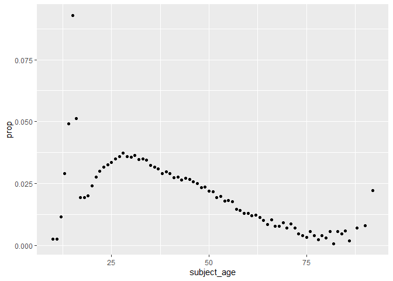
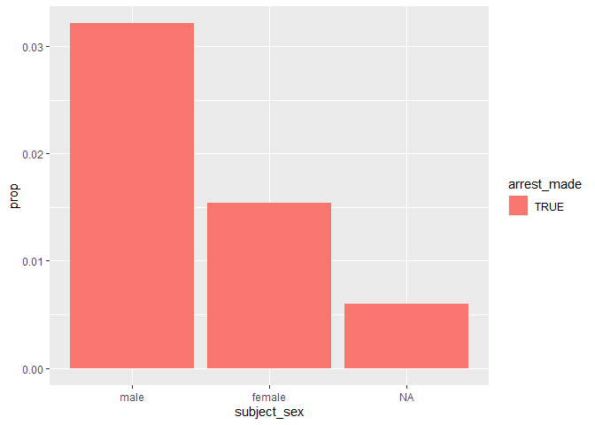
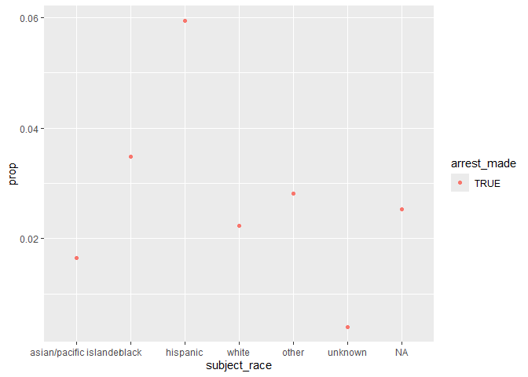
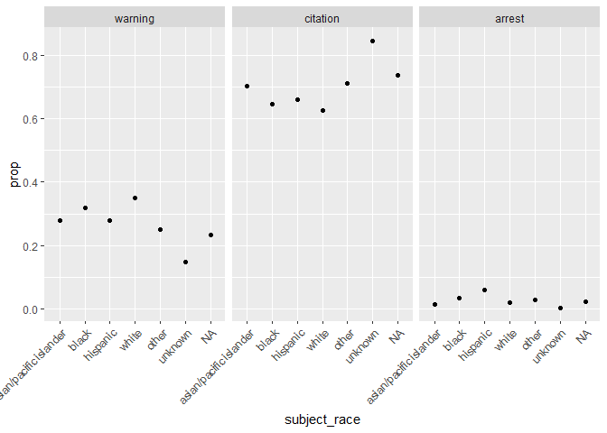
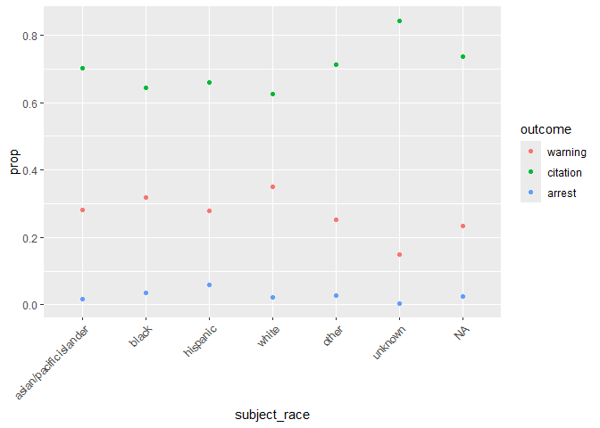

Massachusetts Highway Stops
================
(Your name here)
2020-

- [Grading Rubric](#grading-rubric)
  - [Individual](#individual)
  - [Submission](#submission)
- [Setup](#setup)
  - [**q1** Go to the Stanford Open Policing Project page and download
    the Massachusetts State Police records in `Rds` format. Move the
    data to your `data` folder and match the `filename` to load the
    data.](#q1-go-to-the-stanford-open-policing-project-page-and-download-the-massachusetts-state-police-records-in-rds-format-move-the-data-to-your-data-folder-and-match-the-filename-to-load-the-data)
- [EDA](#eda)
  - [**q2** Do your “first checks” on the dataset. What are the basic
    facts about this
    dataset?](#q2-do-your-first-checks-on-the-dataset-what-are-the-basic-facts-about-this-dataset)
  - [**q3** Check the set of factor levels for `subject_race` and
    `raw_Race`. What do you note about overlap / difference between the
    two
    sets?unq](#q3-check-the-set-of-factor-levels-for-subject_race-and-raw_race-what-do-you-note-about-overlap--difference-between-the-two-setsunq)
  - [**q4** Check whether `subject_race` and `raw_Race` match for a
    large fraction of cases. Which of the two hypotheses above is most
    likely, based on your
    results?](#q4-check-whether-subject_race-and-raw_race-match-for-a-large-fraction-of-cases-which-of-the-two-hypotheses-above-is-most-likely-based-on-your-results)
  - [Vis](#vis)
    - [**q5** Compare the *arrest rate*—the fraction of total cases in
      which the subject was arrested—across different factors. Create as
      many visuals (or tables) as you need, but make sure to check the
      trends across all of the `subject` variables. Answer the questions
      under *observations*
      below.](#q5-compare-the-arrest-ratethe-fraction-of-total-cases-in-which-the-subject-was-arrestedacross-different-factors-create-as-many-visuals-or-tables-as-you-need-but-make-sure-to-check-the-trends-across-all-of-the-subject-variables-answer-the-questions-under-observations-below)
- [Modeling](#modeling)
  - [**q6** Run the following code and interpret the regression
    coefficients. Answer the the questions under *observations*
    below.](#q6-run-the-following-code-and-interpret-the-regression-coefficients-answer-the-the-questions-under-observations-below)
  - [**q7** Re-fit the logistic regression from q6 setting `"white"` as
    the reference level for `subject_race`. Interpret the the model
    terms and answer the questions
    below.](#q7-re-fit-the-logistic-regression-from-q6-setting-white-as-the-reference-level-for-subject_race-interpret-the-the-model-terms-and-answer-the-questions-below)
  - [**q8** Re-fit the model using a factor indicating the presence of
    contraband in the subject’s vehicle. Answer the questions under
    *observations*
    below.](#q8-re-fit-the-model-using-a-factor-indicating-the-presence-of-contraband-in-the-subjects-vehicle-answer-the-questions-under-observations-below)
  - [**q9** Go deeper: Pose at least one more question about the data
    and fit at least one more model in support of answering that
    question.](#q9-go-deeper-pose-at-least-one-more-question-about-the-data-and-fit-at-least-one-more-model-in-support-of-answering-that-question)
  - [Further Reading](#further-reading)

*Purpose*: In this last challenge we’ll focus on using logistic
regression to study a large, complicated dataset. Interpreting the
results of a model can be challenging—both in terms of the statistics
and the real-world reasoning—so we’ll get some practice in this
challenge.

<!-- include-rubric -->

# Grading Rubric

<!-- -------------------------------------------------- -->

Unlike exercises, **challenges will be graded**. The following rubrics
define how you will be graded, both on an individual and team basis.

## Individual

<!-- ------------------------- -->

| Category | Needs Improvement | Satisfactory |
|----|----|----|
| Effort | Some task **q**’s left unattempted | All task **q**’s attempted |
| Observed | Did not document observations, or observations incorrect | Documented correct observations based on analysis |
| Supported | Some observations not clearly supported by analysis | All observations clearly supported by analysis (table, graph, etc.) |
| Assessed | Observations include claims not supported by the data, or reflect a level of certainty not warranted by the data | Observations are appropriately qualified by the quality & relevance of the data and (in)conclusiveness of the support |
| Specified | Uses the phrase “more data are necessary” without clarification | Any statement that “more data are necessary” specifies which *specific* data are needed to answer what *specific* question |
| Code Styled | Violations of the [style guide](https://style.tidyverse.org/) hinder readability | Code sufficiently close to the [style guide](https://style.tidyverse.org/) |

## Submission

<!-- ------------------------- -->

Make sure to commit both the challenge report (`report.md` file) and
supporting files (`report_files/` folder) when you are done! Then submit
a link to Canvas. **Your Challenge submission is not complete without
all files uploaded to GitHub.**

*Background*: We’ll study data from the [Stanford Open Policing
Project](https://openpolicing.stanford.edu/data/), specifically their
dataset on Massachusetts State Patrol police stops.

``` r
library(tidyverse)
```

    ## ── Attaching core tidyverse packages ──────────────────────── tidyverse 2.0.0 ──
    ## ✔ dplyr     1.1.4     ✔ readr     2.1.5
    ## ✔ forcats   1.0.0     ✔ stringr   1.5.1
    ## ✔ ggplot2   3.5.1     ✔ tibble    3.2.1
    ## ✔ lubridate 1.9.4     ✔ tidyr     1.3.1
    ## ✔ purrr     1.0.2     
    ## ── Conflicts ────────────────────────────────────────── tidyverse_conflicts() ──
    ## ✖ dplyr::filter() masks stats::filter()
    ## ✖ dplyr::lag()    masks stats::lag()
    ## ℹ Use the conflicted package (<http://conflicted.r-lib.org/>) to force all conflicts to become errors

``` r
library(broom)
```

# Setup

<!-- -------------------------------------------------- -->

### **q1** Go to the [Stanford Open Policing Project](https://openpolicing.stanford.edu/data/) page and download the Massachusetts State Police records in `Rds` format. Move the data to your `data` folder and match the `filename` to load the data.

*Note*: An `Rds` file is an R-specific file format. The function
`readRDS` will read these files.

``` r
## TODO: Download the data, move to your data folder, and load it
filename <- "C:\\Users\\bdeshpande\\Documents\\Data Science\\data-science-s2025\\challenges\\data\\MAstatepatrol.rds"
df_data <- readRDS(filename)

df_data
```

    ## # A tibble: 3,416,238 × 24
    ##    raw_row_number date       location      county_name  subject_age subject_race
    ##    <chr>          <date>     <chr>         <chr>              <int> <fct>       
    ##  1 1              2007-06-06 MIDDLEBOROUGH Plymouth Co…          33 white       
    ##  2 2              2007-06-07 SEEKONK       Bristol Cou…          36 white       
    ##  3 3              2007-06-07 MEDFORD       Middlesex C…          56 white       
    ##  4 4              2007-06-07 MEDFORD       Middlesex C…          37 white       
    ##  5 5              2007-06-07 EVERETT       Middlesex C…          22 hispanic    
    ##  6 6              2007-06-07 MEDFORD       Middlesex C…          34 white       
    ##  7 7              2007-06-07 SOMERVILLE    Middlesex C…          54 hispanic    
    ##  8 8              2007-06-07 HOPKINTON     Middlesex C…          31 hispanic    
    ##  9 9              2007-06-07 SOMERVILLE    Middlesex C…          21 white       
    ## 10 10             2007-06-06 BARNSTABLE    Barnstable …          56 white       
    ## # ℹ 3,416,228 more rows
    ## # ℹ 18 more variables: subject_sex <fct>, type <fct>, arrest_made <lgl>,
    ## #   citation_issued <lgl>, warning_issued <lgl>, outcome <fct>,
    ## #   contraband_found <lgl>, contraband_drugs <lgl>, contraband_weapons <lgl>,
    ## #   contraband_alcohol <lgl>, contraband_other <lgl>, frisk_performed <lgl>,
    ## #   search_conducted <lgl>, search_basis <fct>, reason_for_stop <chr>,
    ## #   vehicle_type <chr>, vehicle_registration_state <fct>, raw_Race <chr>

# EDA

<!-- -------------------------------------------------- -->

### **q2** Do your “first checks” on the dataset. What are the basic facts about this dataset?

**Observations**:

- It has 24 columns
- The columns describe the type of arrest, along multiple categories,
  and the person that was arrested
- There are over 3 million rows of people arrested

Note that we have both a `subject_race` and `race_Raw` column. There are
a few possibilities as to what `race_Raw` represents:

- `race_Raw` could be the race of the police officer in the stop
- `race_Raw` could be an unprocessed version of `subject_race`

Let’s try to distinguish between these two possibilities.

### **q3** Check the set of factor levels for `subject_race` and `raw_Race`. What do you note about overlap / difference between the two sets?unq

``` r
## TODO: Determine the factor levels for subject_race and raw_Race
unq_sub <-
unique(df_data$subject_race)
unq_raw <-
unique(df_data$raw_Race)

unq_raw
```

    ## [1] "White"                                        
    ## [2] "Hispanic"                                     
    ## [3] "Black"                                        
    ## [4] "Asian or Pacific Islander"                    
    ## [5] "Middle Eastern or East Indian (South Asian)"  
    ## [6] "American Indian or Alaskan Native"            
    ## [7] NA                                             
    ## [8] "None - for no operator present citations only"
    ## [9] "A"

``` r
uniq_tib <-
  tibble(
    subject_race = unq_sub
  )
uniq_tib <- 
  bind_rows(
    uniq_tib, 
    tibble(subject_race = c(NA, NA)))
unc_tib <-
  bind_cols(
    uniq_tib,
    tibble(raw_Race = unq_raw)
  )

unc_tib
```

    ## # A tibble: 9 × 2
    ##   subject_race           raw_Race                                     
    ##   <fct>                  <chr>                                        
    ## 1 white                  White                                        
    ## 2 hispanic               Hispanic                                     
    ## 3 black                  Black                                        
    ## 4 asian/pacific islander Asian or Pacific Islander                    
    ## 5 other                  Middle Eastern or East Indian (South Asian)  
    ## 6 <NA>                   American Indian or Alaskan Native            
    ## 7 unknown                <NA>                                         
    ## 8 <NA>                   None - for no operator present citations only
    ## 9 <NA>                   A

**Observations**:

- What are the unique values for `subject_race`?
  - white, hispanic, black, asian/pacific islander other, unknown
- What are the unique values for `raw_Race`?
  - White, Hispanic, Black, Asian or Pacific Islander, Middle Eastern or
    East Indian (South Asia), None-for no operator present citations
    only, A
- What is the overlap between the two sets?
  - White, Hispanic, Black, Asian/Pacific Islander
- What is the difference between the two sets?
  - The raw race is more specific and does not include an other option
  - There is an option in the raw race for “None” presumably because the
    person was not there and not because they don’t have a race.
  - I don’t know what “A” means
  - Subject Race has two less rows

### **q4** Check whether `subject_race` and `raw_Race` match for a large fraction of cases. Which of the two hypotheses above is most likely, based on your results?

*Note*: Just to be clear, I’m *not* asking you to do a *statistical*
hypothesis test.

``` r
## TODO: Devise your own way to test the hypothesis posed above.
df_races <-
  df_data %>%
    mutate(
      sub_lower = str_to_lower(subject_race),
      raw_lower = str_to_lower(raw_Race)
    ) %>%
  select("raw_row_number", "sub_lower", "raw_lower")
df_boolean <-
  df_races %>%
    reframe(
      same = sub_lower == raw_lower
    ) %>%
  count(same)
df_boolean
```

    ## # A tibble: 3 × 2
    ##   same        n
    ##   <lgl>   <int>
    ## 1 FALSE  194867
    ## 2 TRUE  3219707
    ## 3 NA       1664

``` r
df_races
```

    ## # A tibble: 3,416,238 × 3
    ##    raw_row_number sub_lower raw_lower
    ##    <chr>          <chr>     <chr>    
    ##  1 1              white     white    
    ##  2 2              white     white    
    ##  3 3              white     white    
    ##  4 4              white     white    
    ##  5 5              hispanic  hispanic 
    ##  6 6              white     white    
    ##  7 7              hispanic  hispanic 
    ##  8 8              hispanic  hispanic 
    ##  9 9              white     white    
    ## 10 10             white     white    
    ## # ℹ 3,416,228 more rows

**Observations**

Between the two hypotheses:

- `race_Raw` could be the race of the police officer in the stop
- `race_Raw` could be an unprocessed version of `subject_race`

which is most plausible, based on your results?

- raw_Race is probable an unprocessed version of subject_race
- It is unlikely that raw_Race is the race of the police officer in the
  stop because about 3.2 million cases out of 3.4 million cases had the
  same raw_Race and subject_race which seems a lot less possible than if
  the raw_race was an unprocessed version of subject_race.

## Vis

<!-- ------------------------- -->

### **q5** Compare the *arrest rate*—the fraction of total cases in which the subject was arrested—across different factors. Create as many visuals (or tables) as you need, but make sure to check the trends across all of the `subject` variables. Answer the questions under *observations* below.

(Note: Create as many chunks and visuals as you need)

``` r
df_age <-
  df_data %>%
  group_by(
    subject_age,
    arrest_made
  ) %>%
  summarize(
    n=n()
  ) %>% 
  group_by(
    subject_age
  ) %>%
  mutate(
    total = sum(n),
    prop = n/total
  ) %>% 
  filter(
    arrest_made == TRUE
  )
```

    ## `summarise()` has grouped output by 'subject_age'. You can override using the
    ## `.groups` argument.

``` r
df_age
```

    ## # A tibble: 81 × 5
    ## # Groups:   subject_age [81]
    ##    subject_age arrest_made     n total    prop
    ##          <int> <lgl>       <int> <int>   <dbl>
    ##  1          10 TRUE            1   398 0.00251
    ##  2          11 TRUE            1   397 0.00252
    ##  3          12 TRUE            3   262 0.0115 
    ##  4          13 TRUE            6   206 0.0291 
    ##  5          14 TRUE           15   306 0.0490 
    ##  6          15 TRUE           44   474 0.0928 
    ##  7          16 TRUE          105  2049 0.0512 
    ##  8          17 TRUE          338 17513 0.0193 
    ##  9          18 TRUE          940 48909 0.0192 
    ## 10          19 TRUE         1667 83065 0.0201 
    ## # ℹ 71 more rows

``` r
df_age %>%
  ggplot(aes(subject_age, prop)) +
  geom_point() 
```

    ## Warning: Removed 1 row containing missing values or values outside the scale range
    ## (`geom_point()`).

<!-- -->

``` r
df_sex <-
  df_data %>%
  group_by(
    subject_sex,
    arrest_made
  ) %>%
  summarize(
    n=n()
  ) %>% 
  group_by(
    subject_sex
  ) %>% 
  mutate(
    total = sum(n),
    prop = n/total
  ) %>% 
  filter(
    arrest_made == TRUE
  )
```

    ## `summarise()` has grouped output by 'subject_sex'. You can override using the
    ## `.groups` argument.

``` r
df_sex
```

    ## # A tibble: 3 × 5
    ## # Groups:   subject_sex [3]
    ##   subject_sex arrest_made     n   total    prop
    ##   <fct>       <lgl>       <int>   <int>   <dbl>
    ## 1 male        TRUE        75920 2362238 0.0321 
    ## 2 female      TRUE        16005 1038377 0.0154 
    ## 3 <NA>        TRUE           94   15623 0.00602

``` r
df_sex %>% 
  ggplot() +
  geom_col(aes(x=subject_sex,y=prop, fill = arrest_made))
```

<!-- -->

``` r
df_grouprace <-
  df_data %>%
    group_by(
      subject_race,
      arrest_made
    ) %>%
    summarize(
      n=n()
    ) %>% 
    group_by(
      subject_race
    ) %>% 
    mutate(
      total = sum(n),
      prop = n/total
    ) %>% 
    filter(
      arrest_made == TRUE
    )
```

    ## `summarise()` has grouped output by 'subject_race'. You can override using the
    ## `.groups` argument.

``` r
df_grouprace %>% 
  ggplot(aes(subject_race, prop, color = arrest_made)) +
  geom_point()
```

<!-- -->

**Observations**:

- How does `arrest_rate` tend to vary with `subject_age`?
  - Arrest rate tends to increase until the subject’s age is in the
    mid-twenties, then the arrest rate generally decreases
- How does `arrest_rate` tend to vary with `subject_sex`?
  - Males have about double the arrest rate of women
  - The difference in proportion is between 0.033 and 0.015
- How does `arrest_rate` tend to vary with `subject_race`?
  - When the subject’s race is Hispanic, the arrest rate is the highest
    at 0.06
  - The second highest arrest rate at 0.035 is when the subject’s race
    is Black
  - The lowest arrest rate is when the subject’s race is unknown and the
    second lowest is Asian/Pacific Island
  - I think the lowest arrest rate when the subject’s race is unknown
    could be due to the fact that there are simply fewer people with
    that were not identified with a race.

# Modeling

<!-- -------------------------------------------------- -->

We’re going to use a model to study the relationship between `subject`
factors and arrest rate, but first we need to understand a bit more
about *dummy variables*

### **q6** Run the following code and interpret the regression coefficients. Answer the the questions under *observations* below.

``` r
## NOTE: No need to edit; inspect the estimated model terms.
fit_q6 <-
  glm(
    formula = arrest_made ~ subject_age + subject_race + subject_sex,
    data = df_data %>%
      filter(
        !is.na(arrest_made),
        subject_race %in% c("white", "black", "hispanic")
      ),
    family = "binomial"
  )

fit_q6 %>% tidy()
```

    ## # A tibble: 5 × 5
    ##   term                 estimate std.error statistic   p.value
    ##   <chr>                   <dbl>     <dbl>     <dbl>     <dbl>
    ## 1 (Intercept)           -2.67    0.0132      -202.  0        
    ## 2 subject_age           -0.0142  0.000280     -50.5 0        
    ## 3 subject_racehispanic   0.513   0.0119        43.3 0        
    ## 4 subject_racewhite     -0.380   0.0103       -37.0 3.12e-299
    ## 5 subject_sexfemale     -0.755   0.00910      -83.0 0

**Observations**:

- Which `subject_race` levels are included in fitting the model?
  - Hispanic, White
- Which `subject_race` levels have terms in the model?
  - Hispanic and White

You should find that each factor in the model has a level *missing* in
its set of terms. This is because R represents factors against a
*reference level*: The model treats one factor level as “default”, and
each factor model term represents a change from that “default” behavior.
For instance, the model above treats `subject_sex==male` as the
reference level, so the `subject_sexfemale` term represents the *change
in probability* of arrest due to a person being female (rather than
male).

The this reference level approach to coding factors is necessary for
[technical
reasons](https://www.andrew.cmu.edu/user/achoulde/94842/lectures/lecture10/lecture10-94842.html#why-is-one-of-the-levels-missing-in-the-regression),
but it complicates interpreting the model results. For instance; if we
want to compare two levels, neither of which are the reference level, we
have to consider the difference in their model coefficients. But if we
want to compare all levels against one “baseline” level, then we can
relevel the data to facilitate this comparison.

By default `glm` uses the first factor level present as the reference
level. Therefore we can use
`mutate(factor = fct_relevel(factor, "desired_level"))` to set our
`"desired_level"` as the reference factor.

### **q7** Re-fit the logistic regression from q6 setting `"white"` as the reference level for `subject_race`. Interpret the the model terms and answer the questions below.

``` r
## TODO: Re-fit the logistic regression, but set "white" as the reference
## level for subject_race
fit_q7 <-
  glm(
    formula = arrest_made ~ subject_age + subject_race + subject_sex,
    data = df_data %>%
      mutate(
          subject_race = fct_relevel(subject_race, "white")
      ) %>%
      filter(
        !is.na(arrest_made),
        subject_race %in% c("white", "black", "hispanic")
      ),
    family = "binomial"
  )

fit_q7 %>% tidy()
```

    ## # A tibble: 5 × 5
    ##   term                 estimate std.error statistic   p.value
    ##   <chr>                   <dbl>     <dbl>     <dbl>     <dbl>
    ## 1 (Intercept)           -3.05    0.0109      -279.  0        
    ## 2 subject_age           -0.0142  0.000280     -50.5 0        
    ## 3 subject_raceblack      0.380   0.0103        37.0 3.12e-299
    ## 4 subject_racehispanic   0.893   0.00859      104.  0        
    ## 5 subject_sexfemale     -0.755   0.00910      -83.0 0

**Observations**:

- Which `subject_race` level has the highest probability of being
  arrested, according to this model? Which has the lowest probability?
  - Hispanic
- What could explain this difference in probabilities of arrest across
  race? List **multiple** possibilities.
  - Systemic Racism
  - Biases
  - Maybe age
  - Less generational wealth in the U.S. among families who immigrated
    leads to living in lower income communities that historically been
    targeted as areas with higher crime rates
- Look at the set of variables in the dataset; do any of the columns
  relate to a potential explanation you listed?
  - Potentially age
  - County
  - Whether a citation was given or not

One way we can explain differential arrest rates is to include some
measure indicating the presence of an arrestable offense. We’ll do this
in a particular way in the next task.

### **q8** Re-fit the model using a factor indicating the presence of contraband in the subject’s vehicle. Answer the questions under *observations* below.

``` r
## TODO: Repeat the modeling above, but control for whether contraband was found
## during the police stop
fit_q8 <-
  glm(
    formula = arrest_made ~ subject_age + subject_race + subject_sex + contraband_found,
    data = df_data %>%
      mutate(
          subject_race = fct_relevel(subject_race, "white")
      ) %>%
      filter(
        !is.na(arrest_made),
        subject_race %in% c("white", "black", "hispanic")
      ),
    family = "binomial"
  )
fit_q8 %>% tidy()
```

    ## # A tibble: 6 × 5
    ##   term                 estimate std.error statistic   p.value
    ##   <chr>                   <dbl>     <dbl>     <dbl>     <dbl>
    ## 1 (Intercept)           -1.72    0.0339      -50.8  0        
    ## 2 subject_age            0.0225  0.000866     26.0  2.19e-149
    ## 3 subject_raceblack     -0.0511  0.0270       -1.90 5.80e-  2
    ## 4 subject_racehispanic   0.221   0.0237        9.31 1.32e- 20
    ## 5 subject_sexfemale     -0.306   0.0257      -11.9  1.06e- 32
    ## 6 contraband_foundTRUE   0.609   0.0192       31.7  4.29e-221

**Observations**:

- How does controlling for found contraband affect the `subject_race`
  terms in the model?
  - It decreases the estimate for both Black and Hispanic races
  - The subject’s race being black has a lower estimate than when the
    subject is white
- What does the *finding of contraband* tell us about the stop? What
  does it *not* tell us about the stop?
  - It tells us that there is a lower proportion of Hispanic individuals
    and Black individuals that got arrested when contraband was found
    versus when contraband was not found
  - It does not tell us anything about the baseline we are comparing
    these numbers to, when the subject is white
  - It also does not tell us if the criteria for arrest changes when
    contraband is included in the case.

### **q9** Go deeper: Pose at least one more question about the data and fit at least one more model in support of answering that question.

``` r
df_outcomes <-  
  df_data %>%
    group_by(
      subject_race,
      outcome
    ) %>%
    summarize(
      n=n()
    ) %>% 
    group_by(
      subject_race
    ) %>% 
    mutate(
      total = sum(n),
      prop = n/total
    ) %>% 
    filter(
      !is.na(outcome)
      )
```

    ## `summarise()` has grouped output by 'subject_race'. You can override using the
    ## `.groups` argument.

``` r
df_outcomes %>% 
  ggplot(aes(subject_race, prop)) +
  geom_point()+
  facet_wrap(~ outcome) +
  theme(axis.text.x = element_text(angle = 45, vjust = 1, hjust = 1))
```

<!-- -->

``` r
df_outcomes %>% 
  ggplot(aes(subject_race, prop, color = outcome)) +
  geom_point()+
  theme(axis.text.x = element_text(angle = 45, vjust = 1, hjust = 1))
```

<!-- -->

**Observations**:

- Hispanics have the highest proportion of arrests, however, white
  people have the highest proportion of warnings given
- White people have the lowest proportion of citations given which is
  interesting because a citation is the first, or lowest, punishment a
  person could get when stopped
- When the race is unknown, the proportion of citations was really high,
  which could just be a coincident but is kind of interesting.

## Further Reading

<!-- -------------------------------------------------- -->

- Stanford Open Policing Project
  [findings](https://openpolicing.stanford.edu/findings/).
